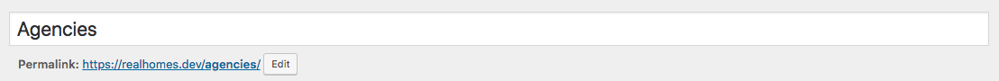
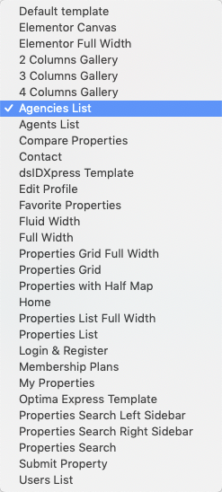
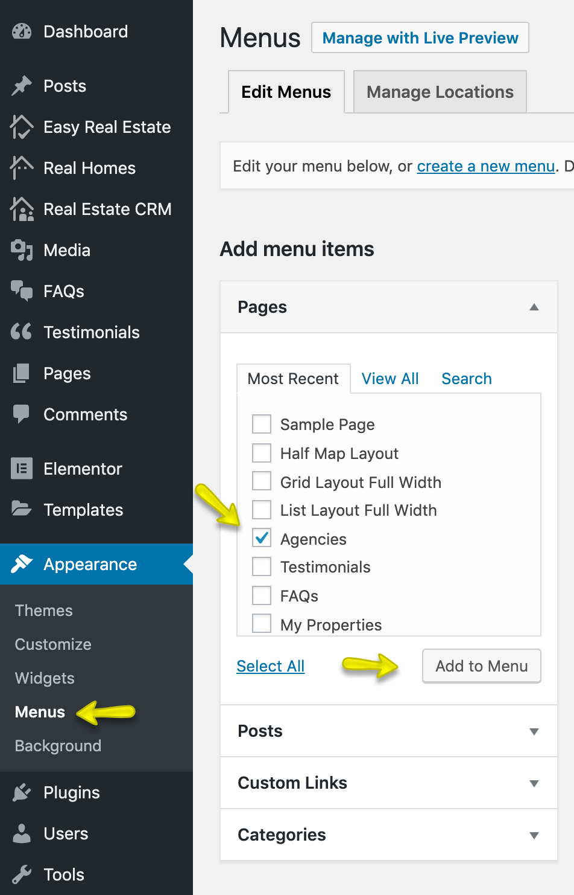
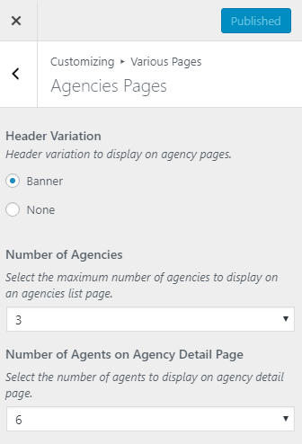
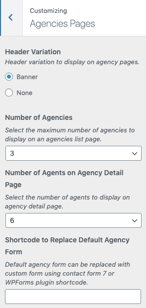

# Add Agencies Page

!!! note
        If you have imported demo contents XML then this page is already created.

Go to **Dashboard → Pages → Add New**

- Provide the page title

- Select the **Agencies List** from page attributes.

**RealHomes Misc Settings - Classic**

**RealHomes Misc Settings - Modern**

### **RealHomes Misc Settings - Ultra**

!!!info "More information about **Banner Settings** can be found here: "
    **https://support.inspirythemes.com/knowledgebase/how-to-configure-the-banner-settings/**

- **Publish** the page once it is ready.

After publishing you need to add the newly created page in menu from **Dashboard → Appearance → Menus**. 

Now that you have agencies page published, configure the settings for agencies page accordingly by navigating based on your version:

=== "v4.5.1 and Later"

    !!! success "RealHomes Settings"
        Dashboard ➤ RealHomes ➤ Settings ➤ Pages ➤ Agencies

=== "v4.5.0 and Earlier"

    !!! info "Legacy Settings"
        Dashboard ➤ RealHomes ➤ Customize Settings ➤ Agencies Pages

    

**Modern**

