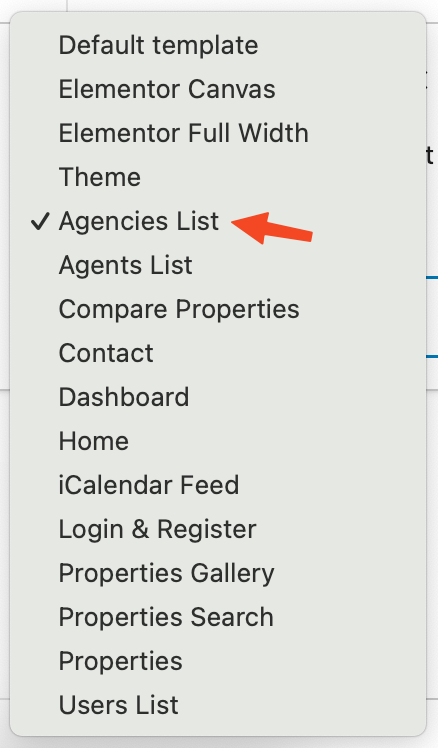
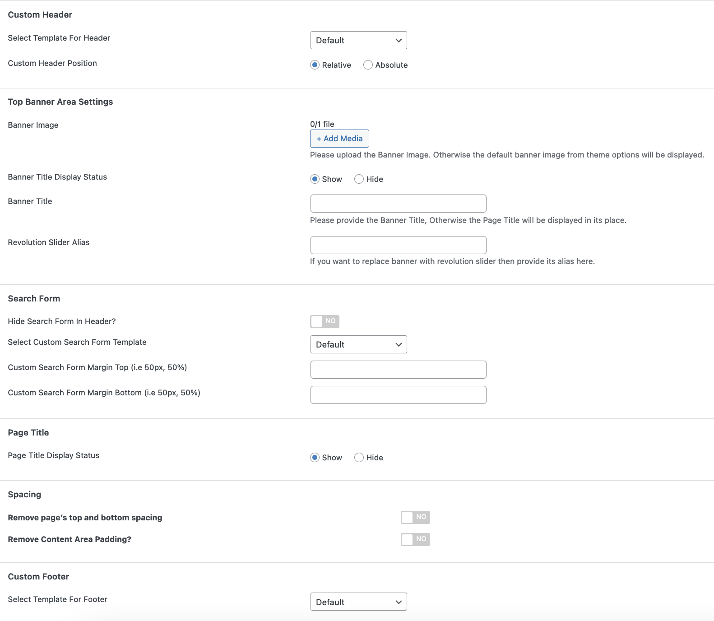
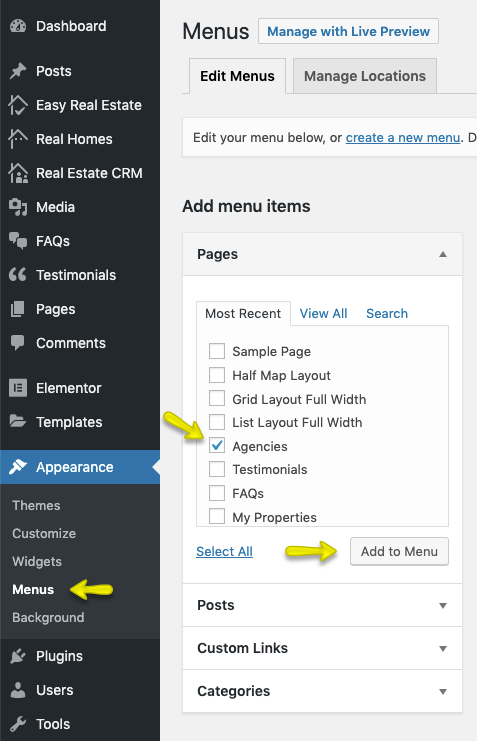
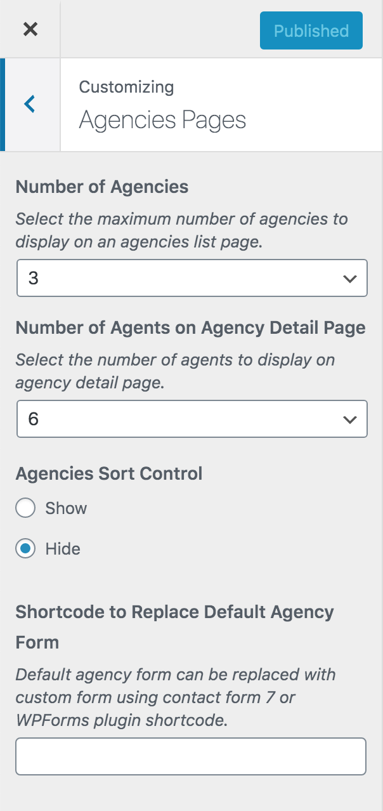
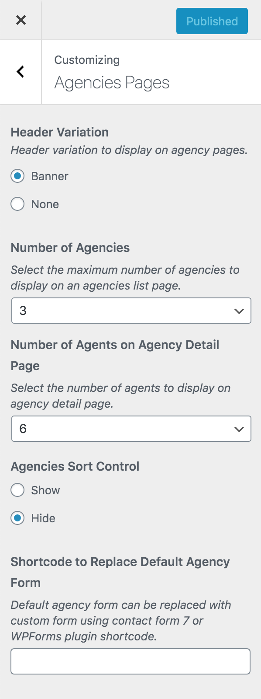

# Add Agencies Page

!!! note
        If you have imported demo contents XML then this page is already created.

Go to **Dashboard → Pages → Add New**

- Provide the page title

- Select the **Agencies List** from page attributes.

**Classic Banner and Spacing Settings**

**Modern Banner and Spacing Settings**

!!!info "More information about **Banner Settings** can be found here: "
    **https://support.inspirythemes.com/knowledgebase/how-to-configure-the-banner-settings/**

- **Publish** the page once it is ready.

After publishing you need to add the newly created page in menu from **Dashboard → Appearance → Menus**. 

Now that you have agencies page published, kindly navigate to **Dashboard → RealHomes → Customize Settings → Various Pages → Agencies Pages** and configure the settings for agencies page accordingly. 

**Classic**

**Modern**

