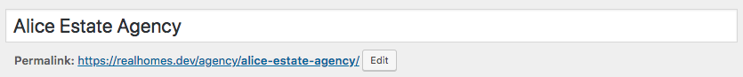
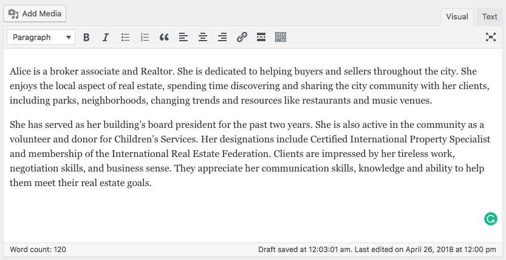
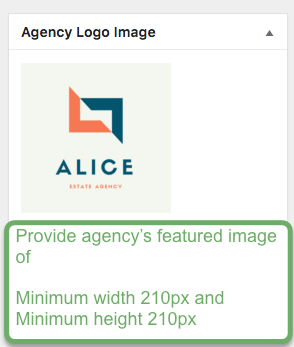

# Add Agency

Go to **Dashboard → Real Homes → Agencies → Add New**

- Provide the agency name

- Provide the agency description

-  Provide the featured image. The image should have minimum width of 210px and minimum height of 210px. The bigger size images will be cropped automatically. 

- Provide the agency related information

- Provide the top banner related information on agency detail page if you want for **Classic** Variation!

- Provide the top banner related information on agency detail page if you want for **Modern** Variation!

- Publish the Agency post once it is ready.