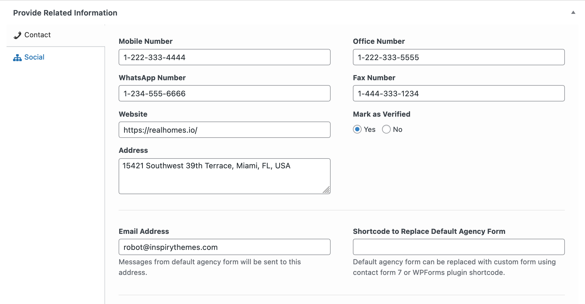
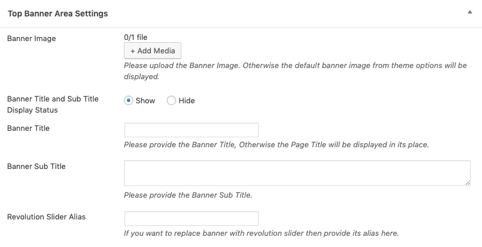
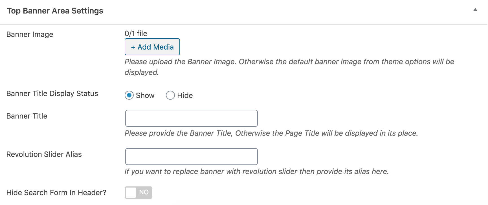

# Add Agency

Go to **Dashboard → Easy Real Estate → Agencies → Add New** to add a new agency.

### Agency Name and Description

- Provide the agency name and description

### Agency Featured Image

-  Provide the featured image. The image should have minimum width of 210px and minimum height of 210px. The bigger size images will be cropped automatically. 

### Agency Information

- Provide the agency related information

### Top Banner Settings

- Provide the top banner related information on agency detail page if you want for **Classic** Variation!

- Provide the top banner related information on agency detail page if you want for **Modern** Variation!

!!!info "More information about **Banner Settings** can be found here: "
    **https://support.inspirythemes.com/knowledgebase/how-to-configure-the-banner-settings/**

- Publish the Agency post once it is ready.