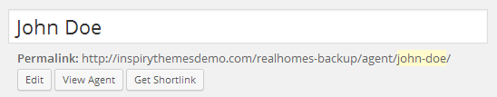
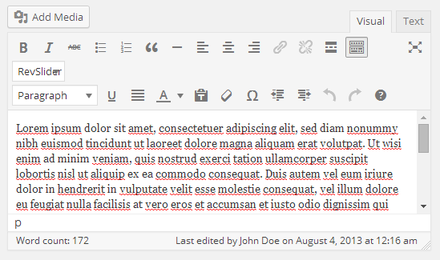

# Add Agent

Go to **Dashboard → Real Homes → Agents → Add New**

- Provide the agent name

- Provide the agent description

-  Provide the featured image. The image should have minimum width of 210px and minimum height of 210px. The bigger size images will be cropped automatically. 

- Provide the agent related information

- Provide the top banner related information on agent detail page if you want for **Classic** Variation!

- Provide the top banner related information on agent detail page if you want for **Modern** Variation!

- Publish the agent post once it is ready.