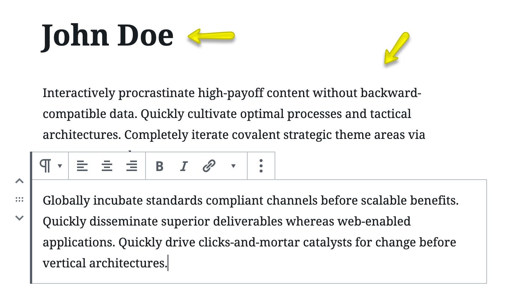
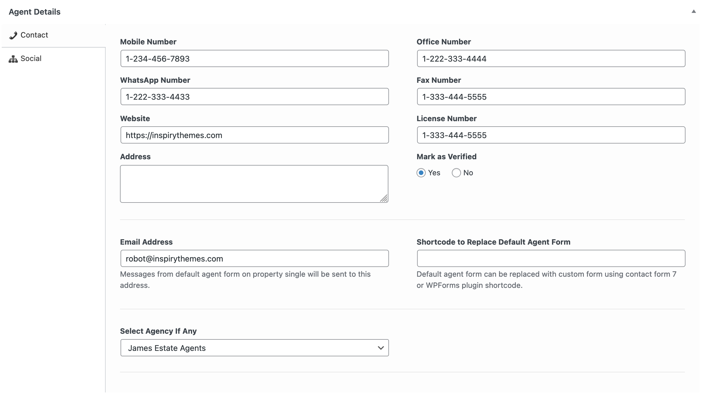

# **Add/Edit an Agent**

This guide explains how to add a new agent to your website.

To get started, navigate to **Dashboard → Easy Real Estate → Agents** and click the **Add New** button.

---

### **1. Agent Name and Description**

-   **Title:** Enter the full name of the agent. This will be the main heading on their profile page.
-   **Description:** Use the content editor to write a detailed biography or description for the agent. This content will appear on their individual page.

---

### **2. Agent Picture (Featured Image)**

In the **Featured Image** panel on the right side, upload the agent's profile picture.

!!!tip "Image Guidelines"
    For best results, use an image that is at least **210px wide and 210px high**. Larger square images are recommended, as they will be automatically cropped to fit.

---

### **3. Agent Details**

Below the main content editor, you will find a section with multiple tabs for entering the agent's specific information.

#### **Basic Tab**

This tab contains fundamental information about the agent. Fill in the required fields as needed.

#### **Contact Tab**

Switch to the **Contact** tab to provide the agent's contact details, such as their mobile, office, and WhatsApp numbers.

#### **Social Tab**

Use the **Social** tab to add links to the agent's social media profiles. These will be displayed as icons on their profile page.

---

### **4. Page Banner Settings**

This section allows you to customize the banner or header area at the top of the agent's individual profile page. The available options and their appearance vary depending on your site's design (Classic, Modern, or Ultra).

**Classic Design**

**Modern Design**

**Ultra Design**

!!!info "For a detailed explanation of these settings, please visit our knowledge base:"
    **https://support.inspirythemes.com/knowledgebase/how-to-configure-the-banner-settings/**

---

### **5. Publish**

Once you have filled in all the necessary information, click the **Publish** button to make the agent's profile live on your website.