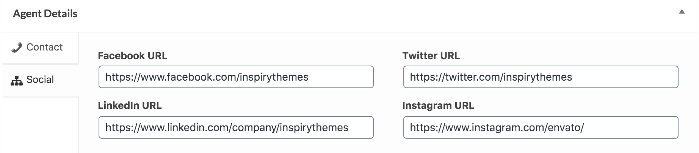

# **Add Agent**

Go to **Dashboard → Easy Real Estate → Agents → Add New** to add a new agent.

### **Agent Name and Description**

- Provide the agent name and description.

###**Agent Picture**

-  Provide the featured image. The image should have minimum width of 210px and minimum height of 210px. The bigger size images will be cropped automatically. 

### **Agent Contact & Agency Details**

Provide the agent contact information using contact tab. 

Provide the agent social networks information using social tab.

### **RealHomes Misc Settings**

**Classic**

**Modern**

**Ultra**

!!!info "More information about **Banner Settings** can be found here: "
    **https://support.inspirythemes.com/knowledgebase/how-to-configure-the-banner-settings/**

- Publish the agent post once it is ready.