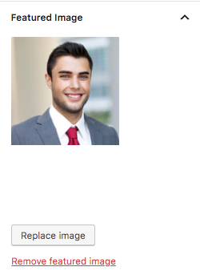

# **Add Agent**

Go to **Dashboard → Easy Real Estate → Agents → Add New** to add a new agent.

### **Agent Name and Description**

- Provide the agent name and description.

###**Agent Picture**

-  Provide the featured image. The image should have minimum width of 210px and minimum height of 210px. The bigger size images will be cropped automatically. 

### **Agent Contact & Agency Details**

- Provide the agent related information including **agent email, mobile, social and agent's agency**

### **Top Banner Settings**

- Provide the top banner related information on agent detail page if you want for **Classic** Variation!

- Provide the top banner related information on agent detail page if you want for **Modern** Variation!

- Publish the agent post once it is ready.