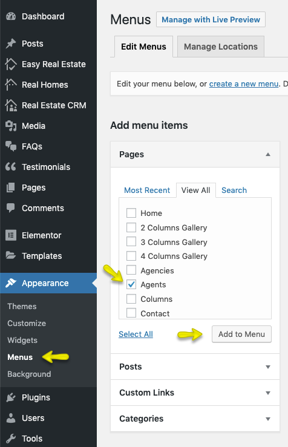
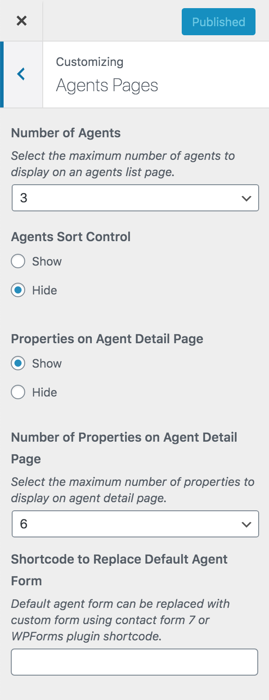
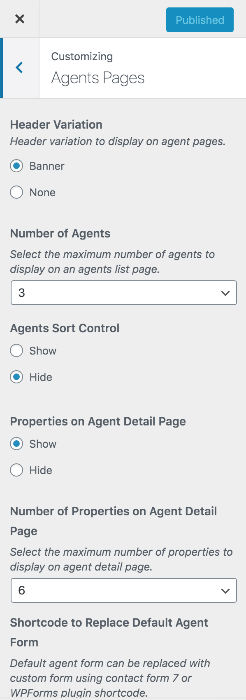

# Add Agents Page

!!! note
        If you have imported demo contents XML then this page is already created.

Go to **Dashboard → Pages → Add New**

- Provide the page title

- Select the **Agents List** from page attributes.

**RealHomes Misc Settings - Classic**

**RealHomes Misc Settings - Modern**

**RealHomes Misc Settings - Ultra**

!!!info "More information about **Banner Settings** can be found here: "
    **https://support.inspirythemes.com/knowledgebase/how-to-configure-the-banner-settings/**

- **Publish** the page once it is ready.

After publishing you need to add the newly created page in menu from **Dashboard → Appearance → Menus**. 

Now that you have agents page published, kindly navigate to **Dashboard → RealHomes → Customize Settings → Agents Pages** and configure the settings for agents page accordingly. 

**Classic**

**Modern**

