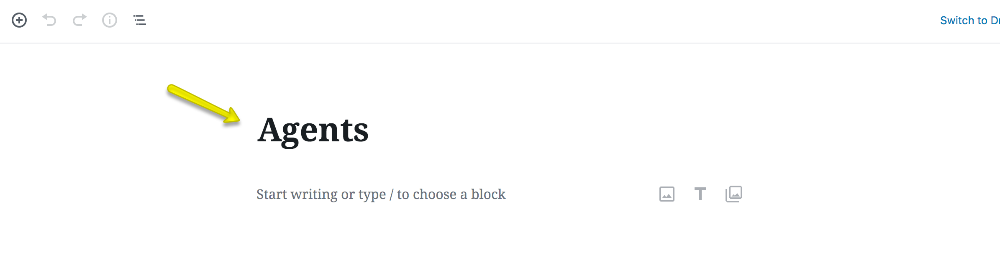

# Add Agents Page

!!! note
    If you have imported demo contents XML, this page is already created.

## Step 1: Create a New Page

1. Navigate to **Dashboard → Pages → Add New**.
2. Provide the page title in the title field.

## Step 2: Select the Agents List Template

1. Go to the **Page Attributes** section.
2. From the dropdown, select **Agents List**.

## Step 3: Configure RealHomes Misc Settings

1. Scroll down to the **RealHomes Misc Settings** panel.
2. Choose the appropriate settings based on your website design:

**Classic**: 

**Modern**: 

**Ultra**: 

!!! info
    More information about **Banner Settings** can be found [here](https://support.inspirythemes.com/knowledgebase/how-to-configure-the-banner-settings/).

## Step 4: Publish the Page

1. Once you have configured all settings, click the **Publish** button.

## Step 5: Add the Page to the Menu

1. Navigate to **Dashboard → Appearance → Menus**.
2. Add the newly created Agents page to the appropriate menu.

## Step 6: Configure Agents Page Settings

1. Go to **Dashboard → RealHomes → Customize Settings → Agents Pages**.
2. Adjust the settings according to your requirements:

**Classic**:

**Modern**: 

!!! info
    These settings allow you to control how the Agents page is displayed on your website, including the header variation, banner title, and sorting options.
