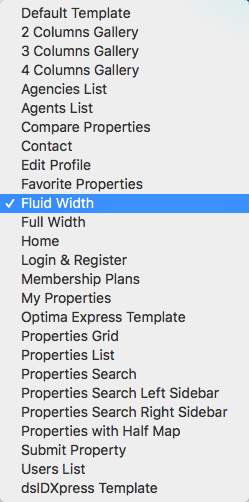
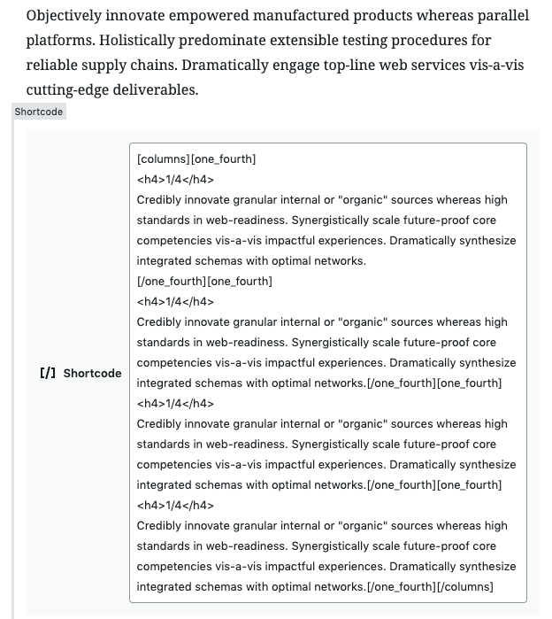
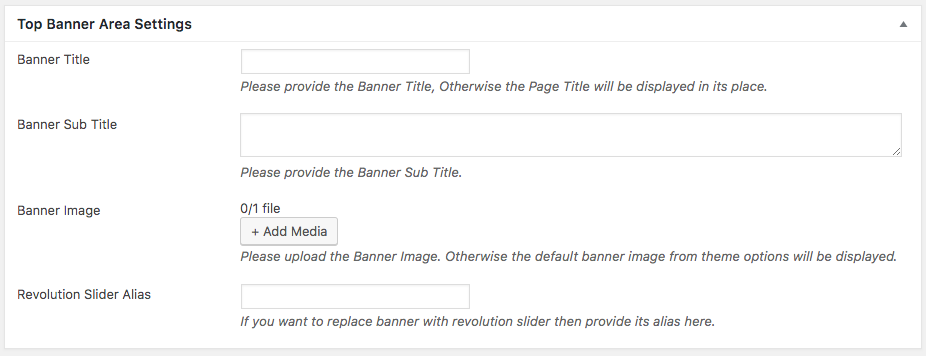
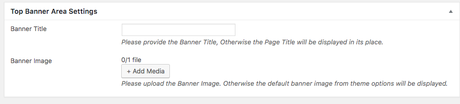

# Add Fluid Width Page

Go to **Dashboard → Pages → Add New**

- Provide the page title

- Select the **Fluid Width** from page attributes.

- Provide the page contents 

- Provide the top banner related information

**Classic**

**Modern**

- Publish the page once it is ready.

- After publishing you need to add the newly created page in menu from **Dashboard → Appearance → Menus**.