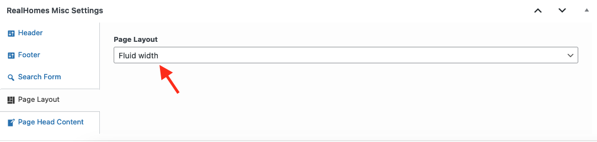

# Fluid Width Page Tempalte

## Full Width Page in v4.2.0

Since v4.2.0, we have introduced Page Layout settings that allows you to set different page layouts as per your requirements. These Page Layout settings are located in RealHomes Misc Settings panel (shown below).

You don't have to select any specific template to have the Fluid Width layout.

## **Add Fluid Width Page in Old Versions**

Go to **Dashboard → Pages → Add New**

### **Page Title**

- Provide the page title

### **Select Page Template**

- Select the **Fluid Width** from page attributes.

### **Add Page Content**

- Provide the page contents.

You can add contents using the Gutenberg editor or you can use the Elementor (**recommended**) to add contents.For more details please check [Elementor Guide](intro-and-installation-elementor.md) page.

### **RealHomes Misc Settings**

**Classic**

**Modern**

**Ultra**

- Publish the page once it is ready.

- After publishing you need to add the newly created page in menu from **Dashboard → Appearance → Menus**.