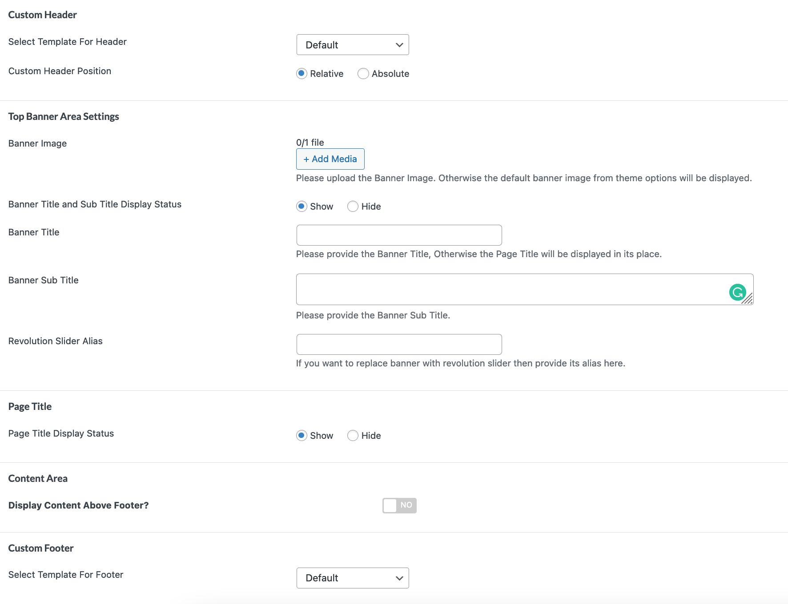
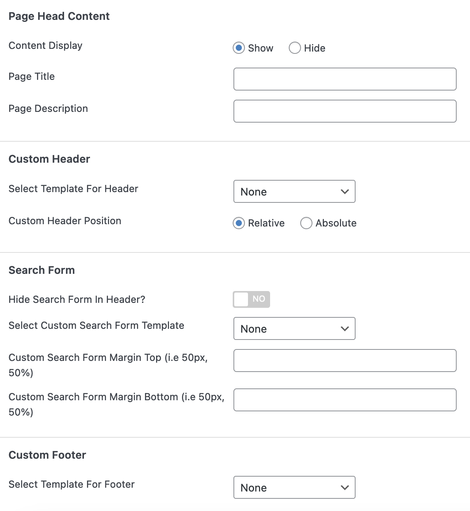

# Add Full Width Page

!!! note
    If you have imported the demo contents XML then this page is already created.

Go to **Dashboard → Pages → Add New**

- Provide the page title

- Select the **Full Width** from page attributes.

- Provide the page contents.

You can add contents using the Gutenberg editor or you can use the Elementor (**recommended**) to add contents.For more details please check [Elementor Guide](intro-and-installation-elementor.md) page.

**Classic Banner and Spacing Settings**

**Modern Banner and Spacing Settings**

### **Ultra Banner and Spacing Settings**

!!!info "More information about **Banner Settings** can be found here: "
    **https://support.inspirythemes.com/knowledgebase/how-to-configure-the-banner-settings/**

- Publish the page once it is ready.

- After publishing you need to add the newly created page in menu from **Dashboard → Appearance → Menus**.