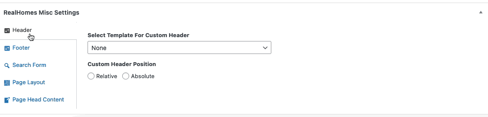

# Full Width Page

## Full Width Page in v4.2.0

Since v4.2.0, we have introduced Page Layout settings that allows you to set different page layouts as per your requirements. These Page Layout settings are located in RealHomes Misc Settings panel (shown below).

You don't have to select any specific template to have the Full Width layout.

## **Add Full Width Page in Old Versions**

!!! note
    If you have imported the demo contents XML then this page is already created.

### **Page Title**

Go to **Dashboard → Pages → Add New**

- Provide the page title

### **Select Page Template**

- Select the **Full Width** from page attributes.

### **Add Page Content**

- Provide the page contents.

You can add contents using the Gutenberg editor or you can use the Elementor (**recommended**) to add contents.For more details please check [Elementor Guide](intro-and-installation-elementor.md) page.

### **RealHomes Misc Settings**

**Classic**

**Modern**

**Ultra**

!!!info "More information about **Banner Settings** can be found here: "
    **https://support.inspirythemes.com/knowledgebase/how-to-configure-the-banner-settings/**

- Publish the page once it is ready.

- After publishing you need to add the newly created page in menu from **Dashboard → Appearance → Menus**.