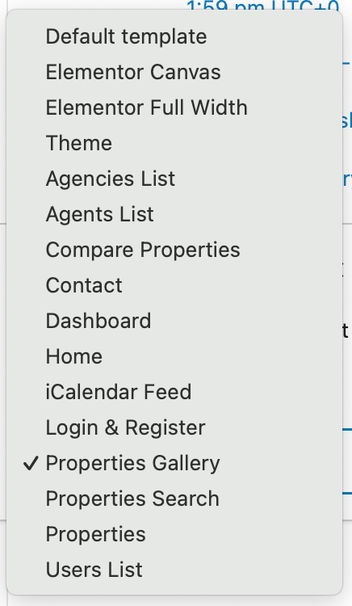
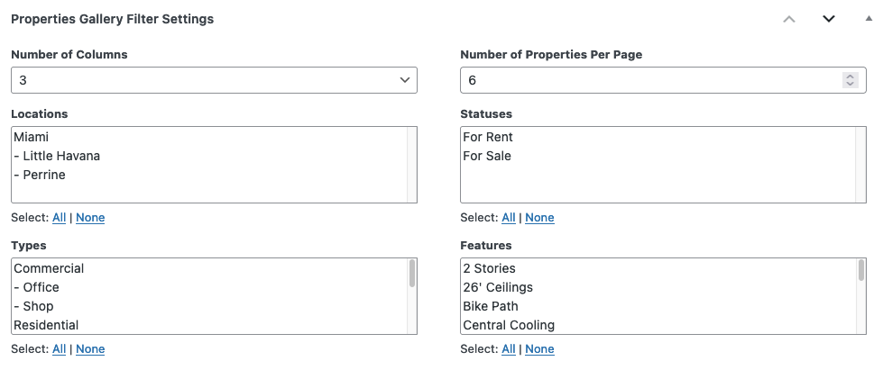
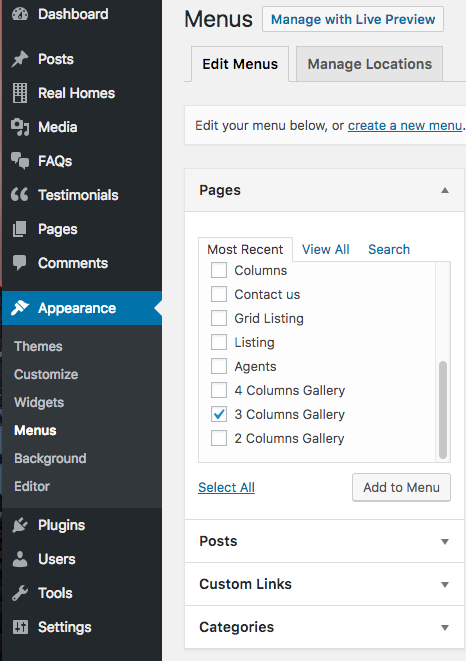

# **Add Gallery Page**

!!! note
    If you have imported demo contents XML then this page is already created.

Go to **Dashboard → Pages → Add New** 

### **Gallery Title**

- Provide the page title 

### **Select Gallery Template**

- Select the appropriate page template for gallery. 

There are 3 templates for gallery page.

1. **2 Columns Gallery**
2. **3 Columns Gallery**
3. **4 Columns Gallery**

### **Properties Gallery Filter Settings**

- Select the settings of your choice in **Properties Gallery Filter Settings**.

In above displayed **Properties Gallery Filter Settings**, you can control the following:

- Number of properties on each gallery page in the pagination.
- Properties by specific status, type and feature.

**Publish** the page once it is ready.

### **Add Gallery Page to Menu**

After publishing you need to add the newly created page in menu from **Dashboard → Appearance → Menus**. 

### **Banner And Spacing Settings**

**Classic**

**Modern**

### **Ultra**

!!!info "More information about **Banner Settings** can be found here: "
    **https://support.inspirythemes.com/knowledgebase/how-to-configure-the-banner-settings/**