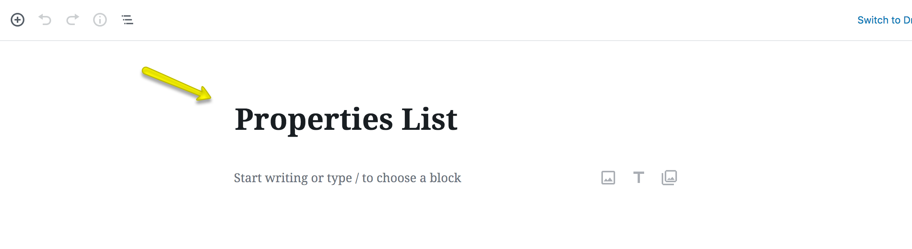
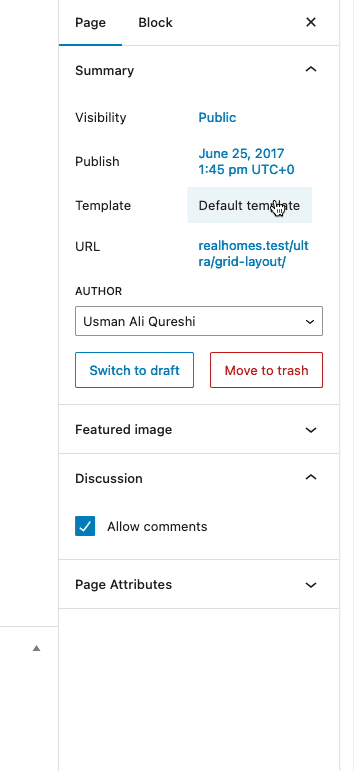

# Layouts for Property Listing Pages

### **Add Property Listing Page**

!!! note
    If you have imported the demo contents XML then this page is already created and you might need to only edit these pages to fulfill your needs.

Go to **Dashboard → Pages** and click the **Add New** button.

- Provide page title

- Choose appropriate page template.

There are **3 Templates** for properties listing pages.

1. **Properties List**
2. **Properties List Full Width**
3. **Properties Grid**
4. **Properties Grid Full Width**
5. **Properties With Half Map**

### **Map Settings**

If you like to disable the map on Properties Listing pages then you can disable it and control several other options by navigating to **Dashboard → Real Homes → Customize Settings → Various Pages → List Templates & Taxonomy Archives** as shown below.

**Classic**

**Modern**

### **Banner And Spacing Settings**

**Classic**

**Modern**

