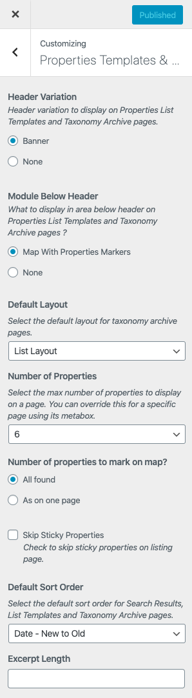

# Layouts for Property Listing Pages

### **Add Property Listing Page**

!!! note
    If you have imported the demo contents XML then this page is already created and you might need to only edit these pages to fulfill your needs.

Go to **Dashboard → Pages** and click the **Add New** button.

- Provide page title

### **Page Layout & Sidebar Management**

You can configure the Listing layout and sidebar settings in the **Page Layout** section. The following options are available in Page Layout area.

- **Page Layout**
- **Page Sidebar**
- **Property Card Design**

There are multiple layout options available for properties listing pages.

1. **Default**
2. **Full Width**
3. **Fluid Width**
4. **Sidebar Right**
5. **Sidebar Left**

### **Map Settings**

If you like to disable the map on Properties Listing pages then you can disable it and control several other options by navigating to **Dashboard → RealHomes → Customize Settings → Various Pages → List Templates & Taxonomy Archives** as shown below.

**Classic**

**Modern**

### **RealHomes Misc Settings**

**Classic**

**Modern**

### **Ultra**

