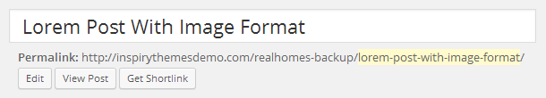
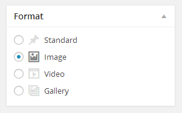
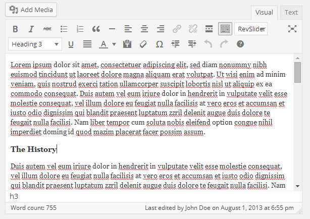
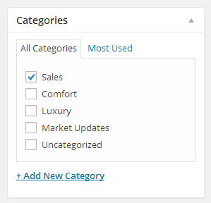
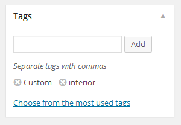
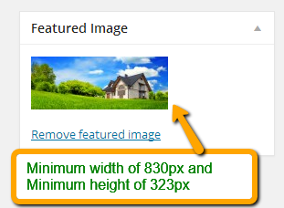

# Add News Post

Go to **Dashboard → Posts → Add New**

- Provide the post title

- Select the related post format 

Post Formats and Related Meta Boxes:

> This theme supports various post formats. So, when you select a post format look out for related meta boxes that will appear after your selection. You need to fill out those meta boxes with related information, so that your post can appear in best possible design.

- Provide the post contents 

- Add or select the related category 

- Add or select the related tags 

- Provide the featured image. The image should have minimum **width of 830px and minimum height of 323px**. The bigger size images will be cropped automatically. 

- Publish the post once it is ready.