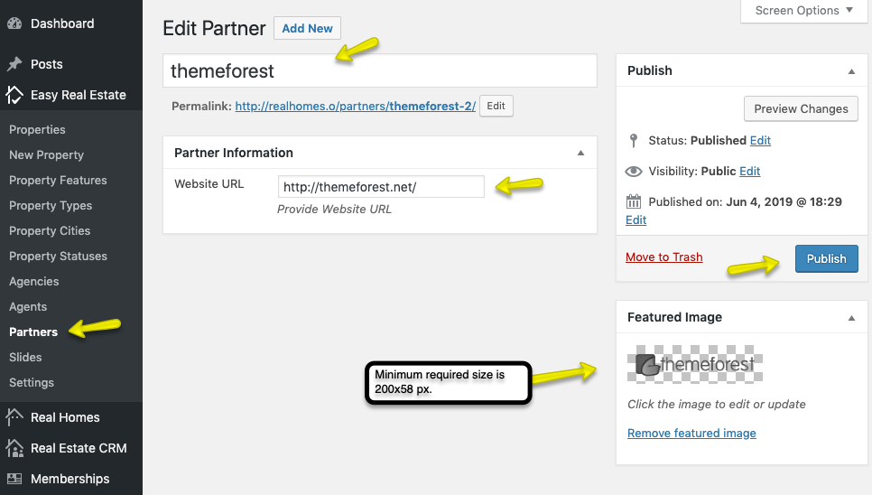

# How to Add a Partner

To add partners to your website, navigate to **RealHomes → Partners → Add New**, as shown in the screenshot below.

While adding a new partner:  
- Enter the **Partner Name** (e.g., ThemeForest).  
- Provide the **Website URL** under *Partner Information*.  
- Upload a **Featured Image** (minimum recommended size: **200×58 px**).  
- Click **Publish** to save the partner.  

