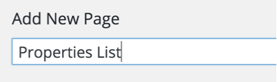
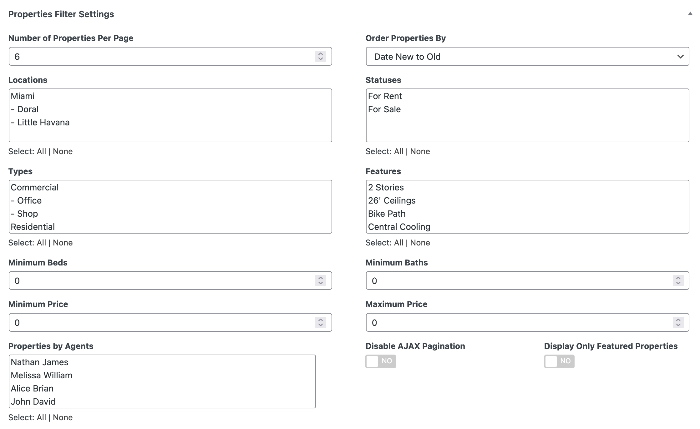

# Add Properties Listing Page

> Note: If you have imported the demo contents XML then this page is already created and you might need to only edit these pages to fulfill your needs.

Go to **Dashboard → Pages → Add New**

- Provide page title

- Choose appropriate page template. 

There are 3 templates for properties list pages.

1. **Property Listing Template**
2. **Property Grid Listing Template**
3. **Map Based Property Listing Template**

- You can filter properties based on your page requirements, Using meta boxes displayed in screen shot below. 

- You can modify information related to banner as displayed in screen shot below. 

-Publish the page once it is ready.

- After publishing you need to add the newly created page in menu from **Dashboard → Appearance → Menus** 

