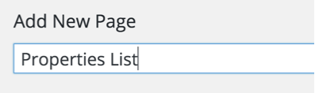
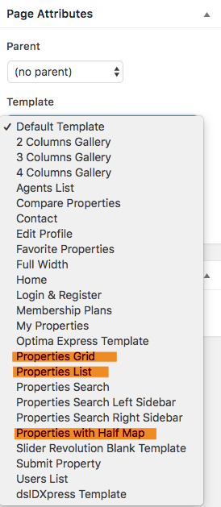
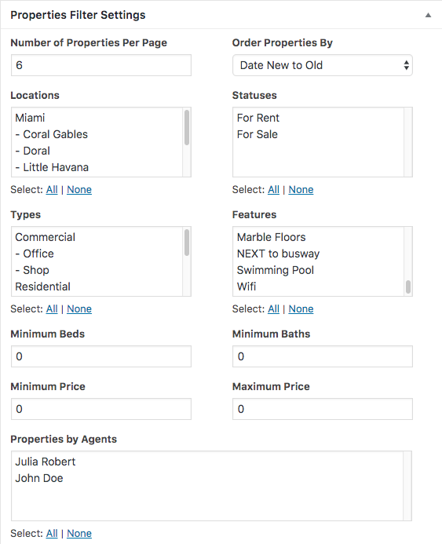
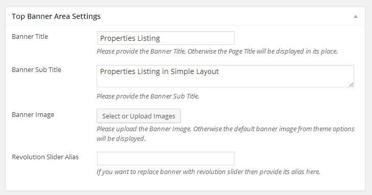
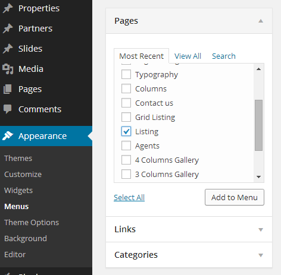

# Add Properties Listing Page

!!! note
    If you have imported the demo contents XML then this page is already created and you might need to only edit these pages to fulfill your needs.

Go to **Dashboard → Pages** and click the **Add New** button.

- Provide page title

- Choose appropriate page template.

There are **3 Templates** for properties listing pages.

1. **Properties List**
2. **Properties Grid**
3. **Properties With Half Map**

### **Properties Filter Settings**

You can **Filter Properties** based on your requirements using meta boxes displayed in screen shot below. 

You can modify the banner information as shown in the screenshot below for **Classic** Variation.

You can modify information related to banner as displayed in the screenshot below for **Modern** Varitaion.

**Publish** the page once it is ready.

### **Add Listing Page to the Menu**

After publishing you need to add the newly created page to the menu via **Dashboard → Appearance → Menus** 

