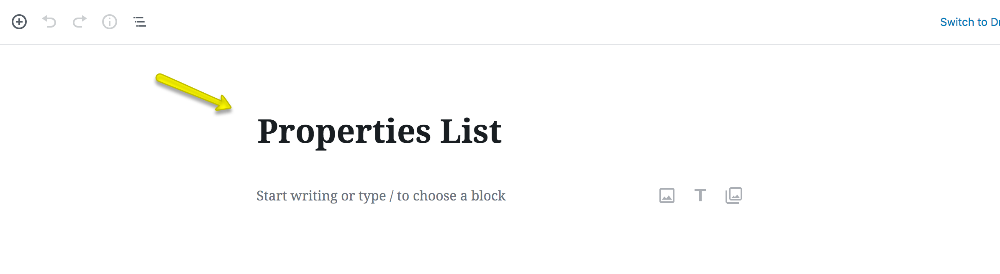
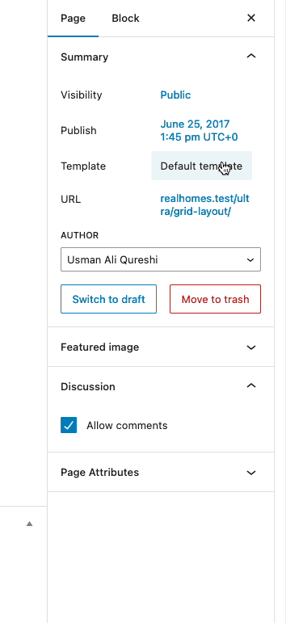
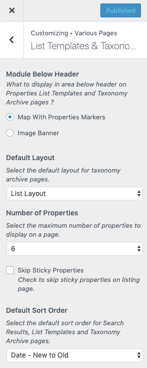
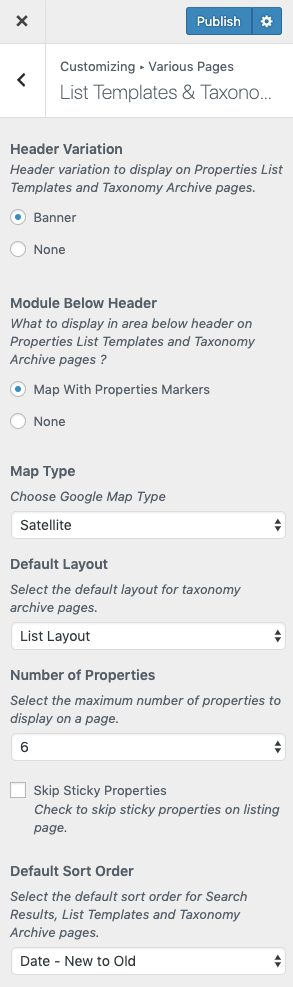
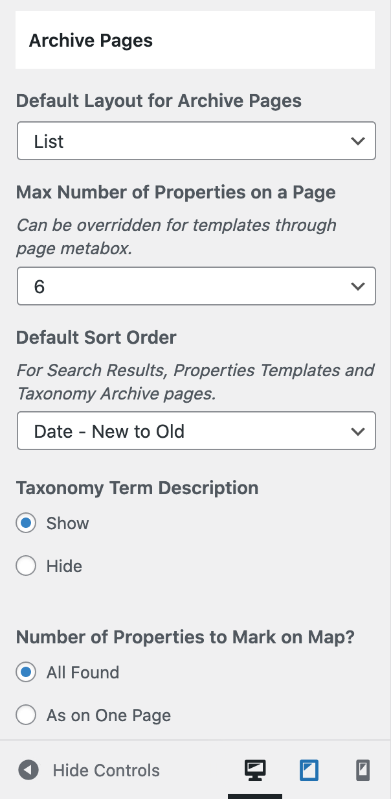
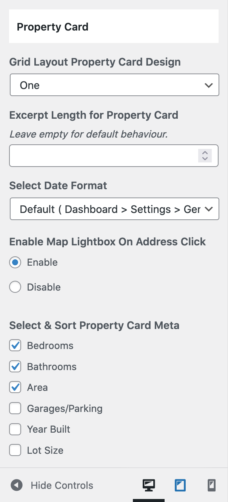

# Add Properties List Page

!!! note
    If you have imported the demo contents XML then this page is already created and you might need to only edit these pages to fulfill your needs.

Go to **Dashboard → Pages** and click the **Add New** button.

- Provide page title

- Choose appropriate page template.

There are **3 Templates** for properties listing pages.

1. **Properties List**
2. **Properties List Full Width**
3. **Properties Grid**
4. **Properties Grid Full Width**
5. **Properties With Half Map**

### **Map Settings**

If you like to disable the map on Properties Listing pages then you can disable it and control several other options by navigating to **Dashboard → Real Homes → Customize Settings → Various Pages → List Templates & Taxonomy Archives** as shown below.

**Classic**

**Modern**

### **Properties Filter Settings**

You can **Filter Properties** based on your requirements using meta boxes displayed in screen shot below. 

In above displayed **Properties Filter Settings**, you can control the following:

- Number of properties on each page.
- The order of properties by date, price etc.
- Properties by specific location, status, type, feature etc.
- Filter the properties by minimum/maximum beds and minimum/maximum price.
- Properties by a specific agent.
- Enable/Disable AJAX Pagination.
- Display Featured Properties only.

### **Banner And Spacing Settings**

**Classic**

**Modern**

**Publish** the page once it is ready.

### **Add Listing Page to the Menu**

After publishing you need to add the newly created page to the menu via **Dashboard → Appearance → Menus** 

### **Properties Archive / Taxonomy Pages**

The settings for Properties Archive & Taxonomy pages are located in **Dashboard → Real Homes → Customize Settings → Various Pages → List Templates & Taxonomy Archives**.

### **Properties Card Settings**

You can change the **Properties Card's** settings for **Grid Layout** in **Dashboard → Real Homes → Customize Settings → Various Pages → List Templates & Taxonomy Archives**.

