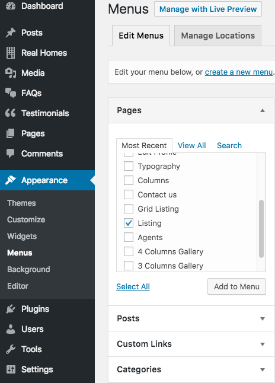

# Add Properties List Page

!!! note
    If you have imported the demo contents XML then this page is already created and you might need to only edit these pages to fulfill your needs.

Go to **Dashboard → Pages** and click the **Add New** button.

- Provide page title

- Choose appropriate page template.

There are **3 Templates** for properties listing pages.

1. **Properties List**
2. **Properties Grid**
3. **Properties With Half Map**

### **Map Settings**

If you like to disable the map on Properties Listing pages then you can disable it by navigating to **Dashboard → Appearance → Customize → Various Pages → List Templates & Taxonomy Archives** as shown below.

### **Properties Filter Settings**

You can **Filter Properties** based on your requirements using meta boxes displayed in screen shot below. 

In above displayed **Properties Filter Settings**, you can control the following:

- Number of properties on each page in the pagination.
- The order of properties by date, price etc.
- Properties by specific location, status, type, feature etc.
- You can also filter the property by minimum/maximum beds and minimum/maximum price.
- You can even show the properties by a specific agent.

### **Banner Settings**

You can modify the banner information as shown in the screenshot below for **Classic** Variation.

You can modify information related to banner as displayed in the screenshot below for **Modern** Varitaion.

**Publish** the page once it is ready.

### **Add Listing Page to the Menu**

After publishing you need to add the newly created page to the menu via **Dashboard → Appearance → Menus** 

