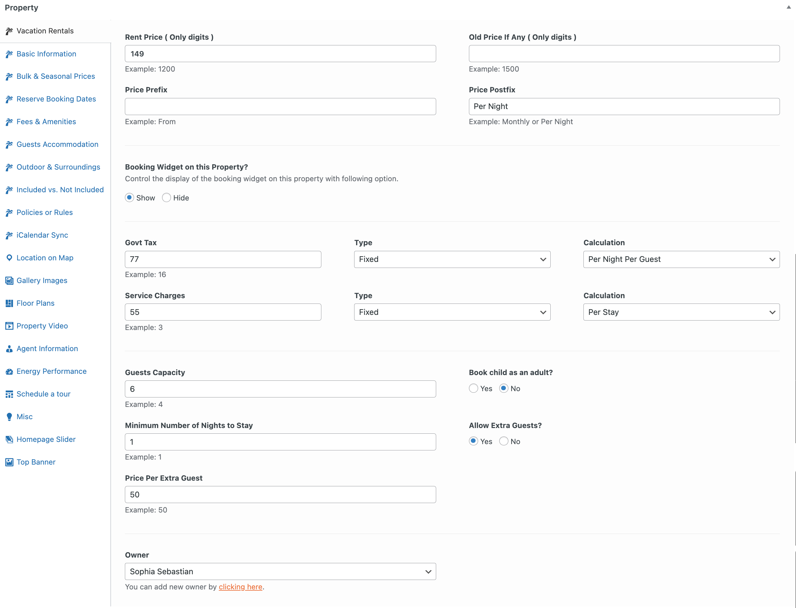
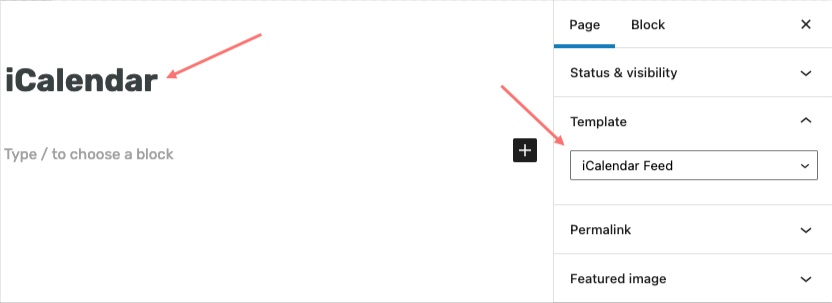
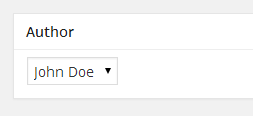

# Add Property

Go to **Dashboard → Easy Real Estate → New Property**

### **Add _Property Title_ and _Property Description_**

### **Add Vacation Rentals Information**

If you are using the **RealHomes Vacation Rentals** plugin and have it configured, a **Vacation Rentals** tab will appear at the top of the property editing screen.

From this section, you can add **rental pricing**, **availability**, **seasonal rates**, **booking details**, and other relevant rental information.

---

### **Dual Pricing (Sale and Rent)**

Starting from **RealHomes v4.4.5**, the theme supports **Dual Pricing**, allowing you to add both a **Sale Price** and a **Rent Price** for a single property.

To enable this feature:

1. Go to **Dashboard → Easy Real Estate → Settings → Price Format**  
2. Enable the **Dual Property Price** option.

Once enabled, you can add both **sale** and **rent prices** on the property edit screen.

### **Display Booking Form Widget**

You can choose either you want to display the booking form or not.

### **Bulk & Seasonal Prices**

This feature helps you in providing discount on longer stays.

### **Reserve Booking Dates**

### **Fees & Amenities**

### **Guest Accomodations**

### **Outdoor & Surroundings**

### **Included and Not Included**

### **Policies or Rules**

### **Availability Calendar**
You can display Availability Calendar by configuring its settings in Customizer settings. To do that, navigate to **Dashboard → RealHomes → Customize Settings → Property Detail Page → Availability Calendar**.

### **iCalendar Synchronization**
To stay up to date and avoid double bookings when you have listed your properties on third-party websites also, you can sync your booking calendar with third-party calendars.

##### **Step 1. Add iCalendar Feed Page**
Before syncing the properties' calendar dates, you need to create an *iCalendar feed* page using the **iCalendar Feed** template as displayed in the following screenshot.

##### **Step 2. Syncing your booking calendar to third-party calendars**
Once you created the iCalendar feed page, you can see the booking calendar feed export URL at the very bottom of the *Vacation Rentals* property metabox tab as you can see in the screenshot given below. Copy the **Feed URL** and add it to the third-party iCalendar import field as per their settings. 

##### **Step 3. Syncing your booking calendar from third-party calendars**
To sync third-party booking calendars with your booking calendar, copy the iCalendar feed URL from their website. After that you can add that feed URL to *iCalendar Import* section as you can see in the screenshot given below. Set a name for reference in the **Feed Name** field and feed URL to the **Feed URL** field. You can add multiple feed URLs to sync from.

### **Add Basic Information**

Add basic information related to property, Like price, area, beds, baths, garages, etc.

### **Mark Property as Featured**

If you want to add this property to featured properties, then mark this property as featured.

### **Provide Location on Google Map**

Provide property address and drag the google map pointer to the correct location. 

### **Add Gallery Images**

Provide property gallery images.

Gallery Images options for **Modern** Variation.

>**Note**: Images should have minimum size of 1240px by 720px. Bigger size images will be cropped automatically. Minimum 2 images are required to display the gallery.

### **Add Floor Plans**

Provide floor plan details, the **Floor Plan Image** and the **Floor Name** are the two important details you must add otherwise the floor section will not show.

### **Add Featured Image**

You must set a featured image to the property. This featured image will be displayed in property cards on listing pages throughout the website.

**Featured Image**

**Classic:** The featured image in **Classic Design** should have Minimum Width of **770 pixels** and Minimum Height of **386 pixels**.

**Modern:** The featured image in **Modern Design** should have Minimum Width of **680 pixels** and Minimum Height of **510 pixels**.

### **Add Video Tour and Virtual Tour**

If your property has any virtual tour video then it is recommended that you upload the video on vimeo or youtube and provide it's URL here with related screenshot or property photo. Property Photo is very important because if there is no property photo assigned to the video then it will not be shown. You can add multiple virtual tour videos by clicking on the **+ Add more** button.

> You can also add 360 Virtual Tour of your property using iframe tag. For example, the following code will add a 360 virtual tour from matterport.com to your property. 

`<iframe src="https://my.matterport.com/show/?m=aSx1MpRRqif&play=1" width="100%" height="100%" allowvr="" allowfullscreen="allowfullscreen"></iframe>`

You can also use the [iPanorama 360 WordPress Virtual Tour Builder](https://wordpress.org/plugins/ipanorama-360-virtual-tour-builder-lite/) plugin to build custom virtual tours and then put current property related `iPanorama` short-code in the **360 Virtual Tour** box.

### **Assign Agent Information**

Choose the kind of information you want to display in agent's information box. 

> Difference Between Author Profile Information and Agent's Information 

> From website visitor point of view there is no difference and information from both will be displayed in similar way. 

> From website admin point of view, An author is basically a site user/member that login into site and add a property using admin side ( If his role is author or above ) OR add a property from front end property submission page ( if his role is subscriber ). An agent is a custom post type and any user with role equal or above author role can add those agents into database and later on assign properties to those agents. So, basically it is a flexible feature that can be used in a way that match your needs.

1. None will hide the agent's information box.
2. Author profile information will display the Author( user who added the property ) information. You can configure your user information from edit profile page ( Please check related documentation section for details of setting up front end profile edit page ). 
If you have adequate rights, You can also modify the author from Author meta box on property edit page. 

3. Display agent's information will display the selected agent's information. You can add the agent from **Dashboard → Agents → Add New**.

### **Energy Performance**
You can add a property **Energy Performance Certificate** details in this section. This is information will be displayed with a visual energy class graph.

### **Mark Property as Sticky**

If you want to make this property stick to top on home page and listing pages, then mark this property as sticky.

### **Add Property in Homepage Slider**

If you want to add this property in homepage slider then check the related option and provide slide image.

### **Add Top Banner**

##### **Classic**

You can override the default banner set in Customizer settings by adding a new banner for a specific property in the settings shown below.

##### **Modern**

Along with banner settings you can also hide the advanced search form in the header on single property page.

!!!info "More information about **Banner Settings** can be found here: "
    **https://support.inspirythemes.com/knowledgebase/how-to-configure-the-banner-settings/**

### **Add/Select Property Features**

You can choose or add property features from related meta box displayed in screenshot below.

You can also add an icon to a property feature. This icon will appear on the property details page, before property feature. To add an icon to a feature, follow these steps:

- Go to **Dashboard → RealHomes → Property Features**

- Create a new property feature or select an existing one. 

- Upload your icon using Property Feature Icon option.

- This icon will now display on property details page in place of default theme icons.

!!! note
    Recommended image size for icon is 64px by 64px.

### **Add/Assign Property Types**

You can choose or add **Property Types** from related meta box displayed in screenshot below.

### **Add/Assign Property Locations**

You can choose or add **Property Locations** from related meta box displayed in screenshot below.

### **Add/Assign Property Statuses**

You can choose or add **Property Statuses** from related meta box displayed in screenshot below. 

### **Assign Parent Property**

If this property is a sub/child property of another property then you can select the parent property from related meta box displayed in screenshot below. 

### **Property Page Layout**

If you want to make the single property page full width, then you can change the **Page Template** from **Templates** to **Property Full Width**. For **Classic Editor**, select the same template from **Page Attributes**.

**Publish the property post once it is ready**.
