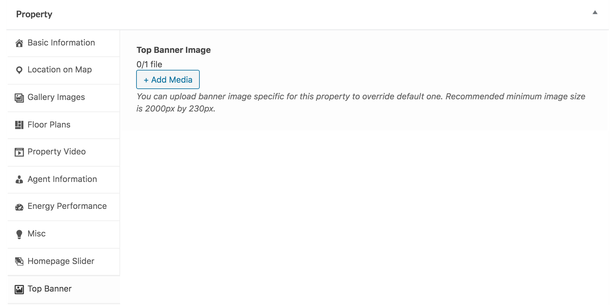

# Add Property

To add a new property, go to **Dashboard → Easy Real Estate → New Property**

### **Add _Property Title_ and _Property Description_**

### **Add Basic Information**

Add basic information about the property e.g. price, area, beds, baths, garages, etc. 

### **Add Additional Information**

You can add any additional information as key-value pairs in additional information.

### **Add Vacation Rentals Information**
If you are using the **RealHomes Vacation Rentals** plugin and have [configured](vacation-rentals-setup.md) it, you can see the **Vacation Rentals** tab at the top. There you can add pricing and other property rental information. For more information, check out the detailed guide to adding a property with [vacation rental information here](add-property-vr.md).

### **iCalendar Synchronization**
To stay up to date and avoid double bookings when you have listed your properties on third-party websites, you can synchronize the booking calendar with third-party calendar services.

#### **Step 1. Add iCalendar Feed Page**
Before syncing the properties' calendar dates, you need to create an *iCalendar feed* page using the **iCalendar Feed** template, as displayed in the following screenshot.

#### **Step 2. Syncing your booking calendar to third-party calendars**
Once you have created the iCalendar feed page, you can see the booking calendar feed export URL at the very bottom of the *Vacation Rentals* property meta-box tab (screenshot below). Copy the **Feed URL** and add it to the third-party iCalendar import field as per their settings. 

#### **Step 3. Syncing your booking calendar from third-party calendars**
To sync third-party booking calendars with your booking calendar, copy the iCalendar feed URL from their website. After that, you can add that feed URL to *iCalendar Import* section (screenshot below). Set a name for reference in the **Feed Name** field and feed URL to the **Feed URL** field. You can add multiple feed URLs to sync from.

### **Mark Property as Featured**

If you want to add this property into featured properties, then mark this property as Featured.

### **Provide Location on Google Map**

Provide property address and drag the Google map pointer to the correct location. 

### **Add Gallery Images**

Provide some nice images for the property gallery.

**Modern**

>**Note**: Images should have minimum size of 1240px by 720px. Bigger size images will be cropped automatically. Minimum 2 images are required to display the gallery.

**Classic**

>**Note**: Images should have minimum size of 1170px by 648px for thumbnails on right and 830px by 460px for thumbnails on bottom. Bigger size images will be cropped automatically. Minimum 2 images are required to display gallery.

### **Add Floor Plans**

Provide floor plan details, the **Floor Plan Image** and the **Floor Name** are the two important details you must add, otherwise, the floor section will not show on property details page.

### **Add Featured Image**

You must set a featured image to the property. This featured image will be displayed in property cards on listing pages throughout the website.

**Featured Image**

**Classic:** The featured image in **Classic Design** should have Minimum Width of **770 pixels** and Minimum Height of **386 pixels**.

**Modern:** The featured image in **Modern Design** should have Minimum Width of **680 pixels** and Minimum Height of **510 pixels**.

### **Add Video Tour and Virtual Tour**

Suppose your property has a virtual tour video. In that case, it is recommended that you upload the video on Vimeo or YouTube and provide its URL here with a related screenshot or property photo.

Property Photo is very important because if no property photo is assigned to the video, then it will not be shown. You can add multiple virtual tour videos by clicking the **+ Add more** button.

> You can also add 360 Virtual Tour of your property using iframe tag. For example, the following code will add a 360 virtual tour from matterport.com to your property. 

`<iframe src="https://my.matterport.com/show/?m=aSx1MpRRqif&play=1" width="100%" height="100%" allowvr="" allowfullscreen="allowfullscreen"></iframe>`

You can also use the [iPanorama 360 WordPress Virtual Tour Builder](https://wordpress.org/plugins/ipanorama-360-virtual-tour-builder-lite/) plugin to build custom virtual tours, and then put current property related `iPanorama` short-code in the **360 Virtual Tour** box.

### **Assign Agent Information**

Choose the information you want to display in the Agent's Information section.

> Difference Between Author Profile Information and Agent's Information 

> From the visitor's point of view, there is no difference, and information for an agent and author will be displayed similarly.

> From the website admin point of view, an author is a site's user/member who logs in to the website and adds a property using the admin side ( If his role is the author or above ) OR adds a property from the front end property submission page ( if his role is a subscriber ). An agent is a custom post type. Any user with a role equal to or above the author role can add those agents into the database and assign properties to those agents later. So, it is a flexible feature that can be used to suit your needs.

1. **None** will hide the agent's information box.
2. **Author profile information** will display the Author( user who added the property ) information. You can configure your user information from edit profile page ( Please check the related documentation section for details of setting up front end profile edit page ). 
If you have adequate rights, You can also modify the author from Author meta box on property edit page. 

3. **Display agent's information** will display the selected agent's information. You can add the agent from **Dashboard → Agents → Add New**.

### **Energy Performance**
You can add a property **Energy Performance Certificate** details in this section. This information will display with a visual energy class graphic representation.

### **Mark Property as Sticky**

If you want to make this property stick to top on home page and listing pages, then mark this property as **Sticky**.

### **Add Property in Homepage Slider**

If you want to add this property to the homepage slider, check the related option and provide a slide image.

### **Add Top Banner**

##### **Classic**

You can override the default banner set in Customizer settings by adding a new banner for a specific property in the below settings.

##### **Modern**

Along with banner settings you can also hide the advanced search form in the header on single property page.

!!!info "More information about **Banner Settings** can be found here: "
    **https://support.inspirythemes.com/knowledgebase/how-to-configure-the-banner-settings/**

### **Custom Header & Footer**

You can also apply a unique custom header and footer to any property by selecting it from **Custom Header** or **Custom Footer** settings.

!!!info "Custom Header & Footer"
    You can create your own Custom Header or Footer using Elementor (free version) with RealHomes. You can consult <strong><a href="https://realhomes.io/documentation/custom-header-footer-elementor/">this section of the documentation</a></strong> to learn how.

### **Add/Select Property Features**

You can choose or add **Property Features** from related meta-box displayed in the following screenshot.

You can also add an icon to each property feature. This icon will appear on the property details page, before property feature. To add an icon to a feature, follow these steps:

- Go to **Dashboard → Real Homes → Property Features**

- Create a new property feature or select an existing one. 

- Upload your icon using Property Feature Icon option.

- This icon will now display on property details page in place of default theme icons.

!!! note
    Recommended image size for icon is 64px by 64px.

### **Add/Assign Property Types**

You can choose or add **Property Types** from related meta box as displayed in screenshot below.

### **Add/Assign Property Locations**

You can choose or add **Property Locations** from related meta-box as displayed below.

### **Add/Assign Property Statuses**

You can choose or add **Property Statuses** from related meta-box displayed in screenshot below.

### **Assign Parent Property**

Suppose this property is a sub/child property of another property. In that case, you can select the **Parent Property** from the related meta box, as shown below.

### **Property Page Layout**

If you want to make the single property page full width, then you can change the **Page Template** from **Templates** to **Property Full Width**. For **Classic Editor**, select the same template from **Page Attributes**.

**Publish the property once it is ready**.
