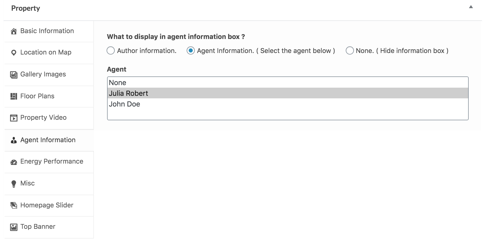
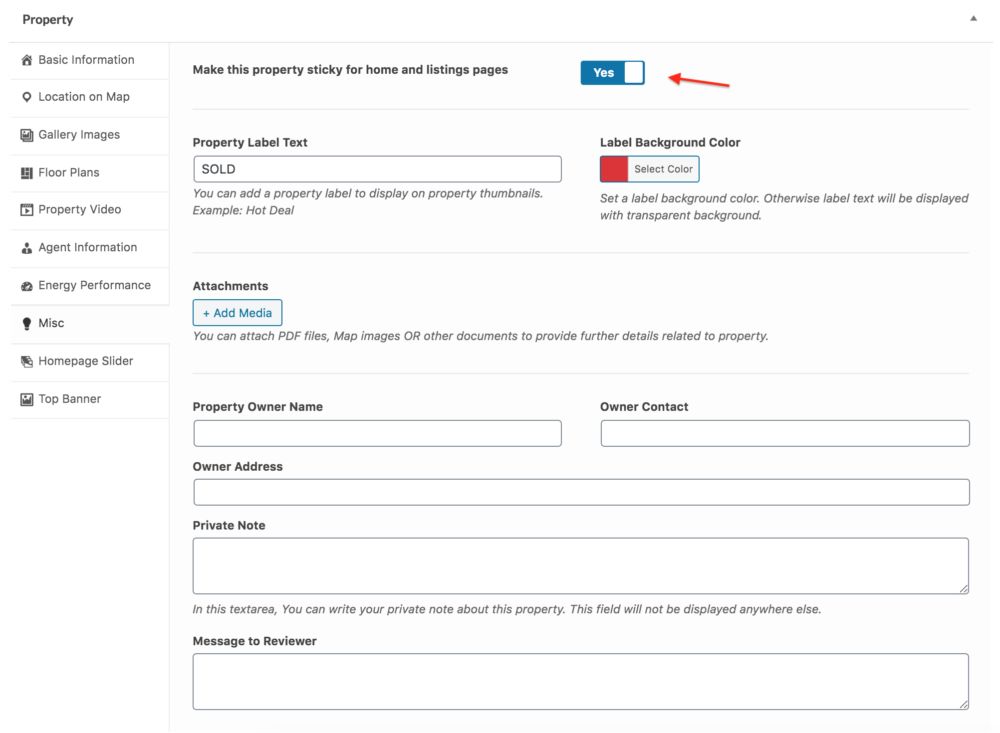

# Add Property

Go to **Dashboard → Real Homes → Properties → Add New**

### **Add Property Title**

### **Add Property Description**

### **Add Basic Information**

Add basic information related to property, Like price, area, beds, baths, garages etc. 

If you want to add this property into featured properties then mark this property as featured. 

### **Provide Location on Google Map**

Provide property address and drag the google map pointer to correct location. 

### **Add Gallery Images**

Provide property gallery images.

Gallery Images options for **Classic** Variation.

>**Note**: Images should have minimum size of 770px by 386px for thumbnails on right and 830px by 460px for thumbnails on bottom. Bigger size images will be cropped automatically, images must be in landscape format. Minimum 2 images are required to display gallery.

Gallery Images options for **Modern** Variation.

>**Note**: Images should have minimum size of 1200px by 680px. Bigger size images will be cropped automatically, images must be in landscape format. Minimum 2 images are required to display gallery.

### **Add Floor Plans**

Provide floor plan details.

### **Add Featured Image**

You must set a featured image to the property.

**Featured Image (Classic Design)**

**Featured Image (Modern Design)**

### **Add Video Tour and Virtual Tour**

If your property has any virtual tour video then it is recommended that you upload the video on vimeo or youtube and provide it's URL here with related screen shot or property photo.

> You can also add 360 Virtual Tour of your property using iframe tag. For example, the following code will add a 360 virtual tour from matterport.com to your property. 

`<iframe src="https://my.matterport.com/show/?m=aSx1MpRRqif&play=1" width="100%" height="100%" allowvr="" allowfullscreen="allowfullscreen"></iframe>`

### **Assign Agent Information**

Choose the kind of information you want to display in agent's information box. 

> Difference Between Author Profile Information and Agent's Information 

> From website visitor point of view there is no difference and information from both will be displayed in similar way. 

> From website admin point of view, An author is basically a site user/member that login into site and add a property using admin side ( If his role is author or above ) OR add a property from front end property submission page ( if his role is subscriber ). An agent is a custom post type and any user with role equal or above author role can add those agents into database and later on assign properties to those agents. So, basically it is a flexible feature that can be used in a way that match your needs.

1. None will hide the agent's information box.
2. Author profile information will display the Author( user who added the property ) information. You can configure your user information from edit profile page ( Please check related documentation section for details of setting up front end profile edit page ). 
If you have adequate rights, You can also modify the author from Author meta box on property edit page. 

3. Display agent's information will display the selected agent's information. You can add the agent from **Dashboard → Agents → Add New**.

### **Mark Property as Sticky**

If you want to make this property stick to top on home page and listing pages, then mark this property as sticky.

### **Add Property in Homepage Slider**

If you want to add this property in homepage slider then check the related option and provide slide image.

### **Add Aditional Information**

You can provide any additional information as key-value pairs. 

### **Add/Select Property Features**

You can choose or add property features from related meta box displayed in screen shot below.

You can also add an icon to a property feature. This icon will appear on the property details page, before property feature. To add an icon to a feature, follow these steps:

- Go to **Dashboard → Real Homes → Property Features**

- Create a new property feature or select an existing one. 

- Upload your icon using Property Feature Icon option.

- This icon will now display on property details page in place of default theme icons.

!!! note
    Recommended image size for icon is 64px by 64px.

### **Add/Assign Property Types**

You can choose or add property types from related meta box displayed in screen shot below.

### **Add/Assign Property Locations**

You can choose or add property locations from related meta box displayed in screen shot below.

### **Add/Assign Property Statuses**

You can choose or add property statuses from related meta box displayed in screen shot below. 

### Assign Parent Property

If this property is a sub/child property of another property then you can select the parent property from related meta box displayed in screen shot below. 

**Publish the property post once it is ready**.
