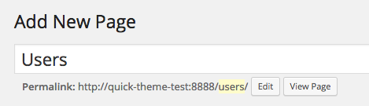
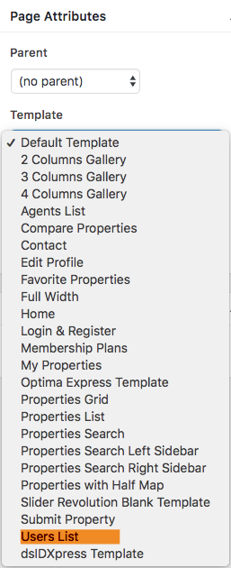
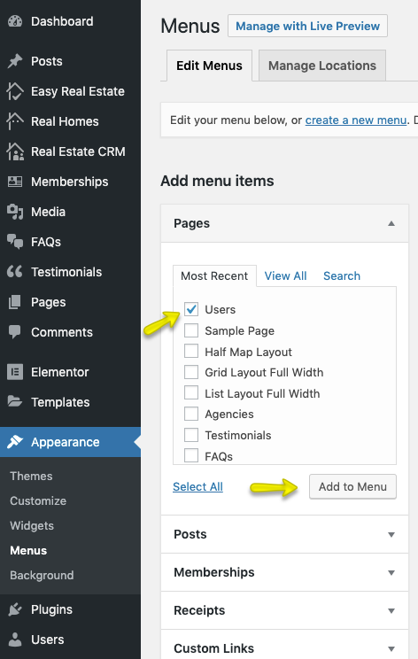

# Add Users Page

**User List Template** is added to display the registered users as agents. To add it go to **Dashboard → Pages → Add New**

Provide the page title 

Select the **Users List** from page attributes.

Provide information related to top banner.

**Classic**

**Modern**

!!!info "More information about **Banner Settings** can be found here: "
    **https://support.inspirythemes.com/knowledgebase/how-to-configure-the-banner-settings/**

Publish the page once it is ready.

After publishing you need to add the newly created page in menu from **Dashboard → Appearance → Menus**.

