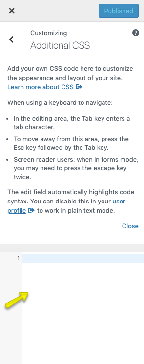
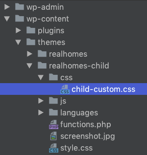
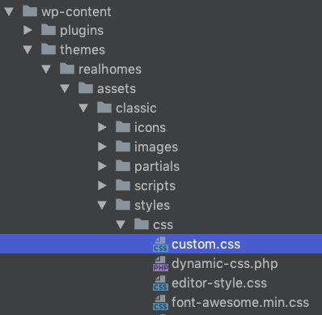
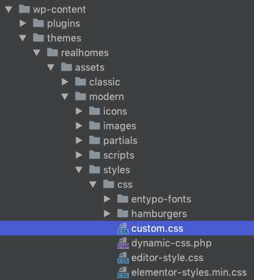

# Additional or Custom CSS

## Additional CSS

**Additional CSS** - Go to **Dashboard → RealHomes → Customize Settings** and click on **Additional CSS** to add any CSS code. 

## Custom CSS in Child Theme

The `realhomes-child/css/child-custom.css` file is provided in the child theme to add significant CSS changes.

!!! note
    It is highly recommended to use a child theme for any changes you want to make, as this way, you can update the parent theme whenever an update becomes available. Copy a template file you want to change to a child theme after creating the same directory structure and then modify it. For more info http://codex.wordpress.org/Child_Themes.

## Custom CSS in Parent Theme

If you are not using the child theme, you can use the **custom.css** file of the parent theme for **Classic** and **Modern** design variations separately.

If you are using the *Classic* design, the **custom.css** file path would be `realhomes/assets/classic/css/custom.css` 

And if you are using the **Modern** design,the **custom.css** file path would be `realhomes/assets/modern/css/custom.css`

## Use Child Theme for Customization ( Highly Recommended )

!!! warning
    To quickly update the parent theme whenever a new update becomes available, it is highly recommended to use a child theme for any customization you want to make.
    
    A pre-built ready-to-use child theme is included in the main theme pack that you have downloaded from ThemeForest.

