## Configure Property Search in Ultra Design

Before starting with this section, Make sure you have pretty permalinks enabled from **Dashboard → Settings → Permalinks** and Property Search Page is created.

## Ultra Search Elementor Widget

Ultra design is completely based on Elementor, so you can use Ultra Seach Form Elementor Widget anywhere. You can find the Ultra Search form in Elementor Widgets panel.

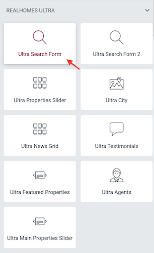

### **Basic Settings**

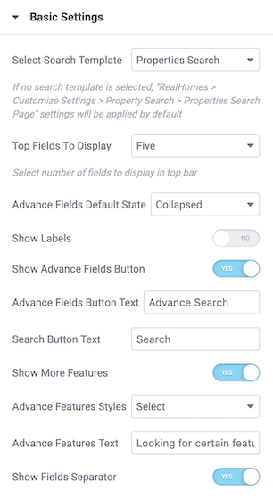

### **Search Fields Sorting**

### **Property Locations**

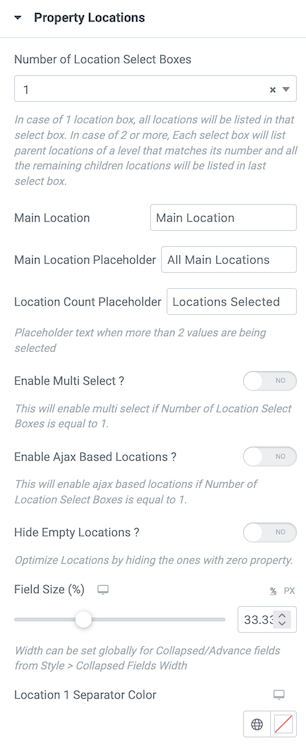

### **Property Status**

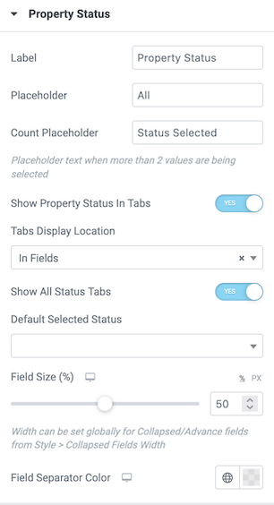

### **Property Type**

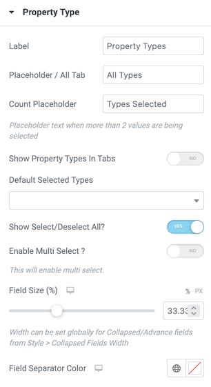

### **Bedrooms**

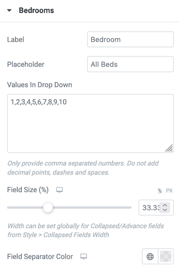

### **Bathrooms**

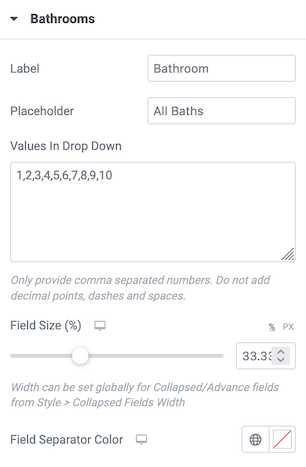

### **Min Max Price**

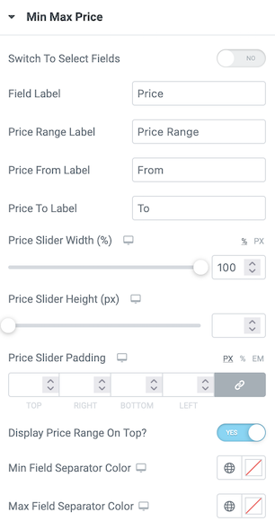

### **Garages**

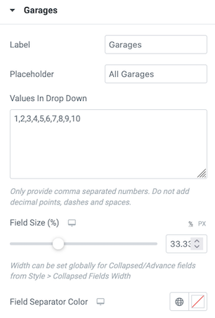

### **Agents**

### **Agencies**

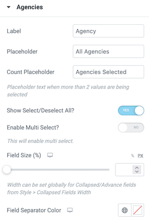

### **Min Max Area**

### **Keyword**

### **Property ID**

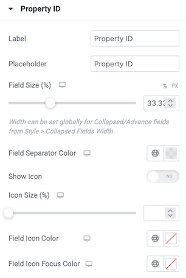

### **Additional Fields**

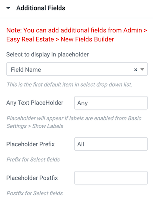