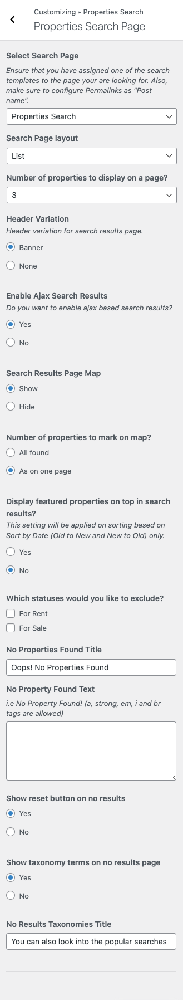
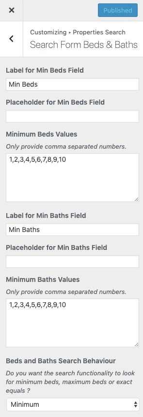
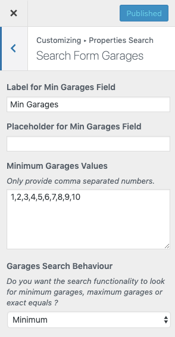
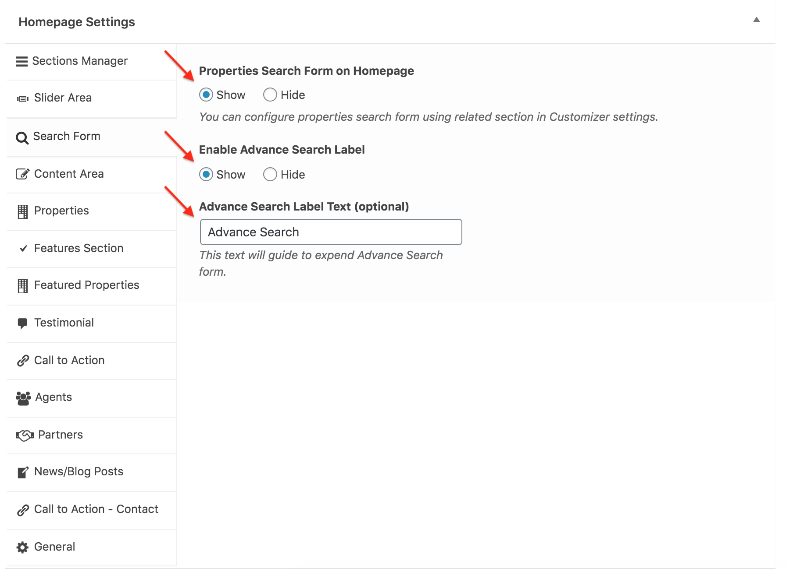

## Configure Property Search Settings

Before starting with this section, Make sure you have pretty permalinks enabled from **Dashboard → Settings → Permalinks** and Property Search Page is created.

Follow the steps below to configure the search functionality.

### **Select Property Search Page**

Please navigate to **Dashboard → Real Homes → Customize Settings** and then go into **Properties Search → Properties Search Page** and select the property search page from **Select Search Page**. You can setup other options according to your requirements.

After this you will have a property search form displayed on homepage.

Now, you can also use the **RealHomes - Advance Search Widget** in sidebar as that widget uses the same configurations.

### **Search Form Layout**

Navigate to **Search Form Basics** section in **Properties Search** panel, In this section you can change **Search Form Layout** to **Default** or **Smart**. You can check both layouts in the following screenshots.

**Default Layout**

**Smart Layout**

### **Search Form Fields - Show / Hide - Reorder by Drag & Drop**

You can also **Show / Hide Fields** on properties search form as well as **Drag and Drop the Fields** to change their display order and you can also change the labels.

### **Advance Search Fields**

### **Number Of Fields to Display in Top Row**

### **Search Button Label & Any Text Label**

### **Search Form Locations**

Properties Search panel contains a section in **Customizer** for Locations **Dashboard → RealHomes → Customize Settings → Properties Search → Search Form Locations** to configure the **Locations** fields of the advance search form.

First thing is to decide the number of location fields you want to set up for search form. Do not worry too much about it as you can always change these settings in future to match your changing needs.

Select 1 if you want to display all locations into one select box.

Select 2 if you want to display locations like **State → City OR City → Suburb**.

Select 3 if you want to display locations like **Country → State → City OR State → City → Suburb**

Select 4 if you want to display locations like **Country → State → City → Suburb**

After that you need to provide suitable labels for location boxes. You can provide these based on your own needs.

If you face any confusion, Simply make the changes in settings and preview them on homepage. Keep making the changes until you get what you want.

You can also Hide Empty Locations and Sort Locations Alphabetically. It means that if a location is not assigned to any property it won't be displayed in the location drop-down list.

### **Enable Dynamic Locations** (Optimize Large Number Of Locations)

Speeding up the loading time of large number of locations is now possible. All you have to do is to navigate to **Dashboard → Real Homes → Customize Settings → Properties Search → Search Form Locations** and activate Enable Dynamic Locations option as shown below.

It will help your website performance by loading the locations dynamically by scrolling and lists only 15 locations non-hierarchically and 15 more with each scroll until all locations are listed.

### **Search Form Keyword**

Navigate to **Dashboard → RealHomes → Customize Settings → Properties Search → Search Form Keyword** to change **Keyword Label** and **Placeholder Text**.

### **Search Form Property ID**

Navigate to **Dashboard → RealHomes → Customize Settings → Properties Search → Search Form Property ID** to change **Property ID Label** and **Placeholder Text**.

### **Search Form Property Status**

Navigate to **Dashboard → RealHomes → Customize Settings → Properties Search → Search Form Property Status** to change **Property Status Label** and **Placeholder Text**.

### **Search Form Agents**

Navigate to **Dashboard → RealHomes → Customize Settings → Properties Search → Search Form Agents** to enable **Multi-Select Feature** and change **Agent Field Label**, **Placeholder Text** and **Selected Text**.

### **Beds & Baths Fields**

Properties Search panel also contains a special section for Beds & Baths at **Dashboard → RealHomes → Customize Settings → Properties Search → Search Form Beds and Baths**. Using which, Beds and Baths fields can be customized to your requirements.

In this section:

1) You can modify the Labels for the Beds & Baths Field.

2) You can also provide the values to be displayed in the drop-down lists for both fields.

3) You can modify the search behaviour for beds and baths to Minimum, Maximum or Equals.

### **Search Form Garages**

Properties Search panel contains a special section for Garages at **Dashboard → RealHomes → Customize Settings → Properties Search → Search Form Garages**. Using which, Garages fields can be customized to your requirements.

In this section:

1. You can modify the Labels for the Garages Field.

2. You can also provide the values to be displayed in the drop-down lists for this field.

3. You can modify the search behaviour for garages to Minimum, Maximum or Equals.

### **Search Form Prices**

Properties Search panel also contains a special section for Prices at **Dashboard → RealHomes → Customize Settings → Properties Search → Search Form Prices**. Using which, Minimum and Maximum prices fields can be customized to your requirements.

### **Search Form Areas**

Properties Search panel contains a section for Area and can be found at **Dashboard → RealHomes → Customize Settings → Properties Search → Search Form Areas**. In this Customizer section, Minimum and Maximum area fields can be customized to your requirements.

### **Search Form Property Features**

Navigate to **Dashboard → RealHomes → Customize Settings → Properties Search → Search Form Property Features** to show or hide the **Property Features** section and change the **Title for Features Toggle**.

### **Change Advance Search Form Bottom Label Text (Optional)**

The advance search label which is displaying at the bottom right corner of the properties search form in Modern Design can be changed in **Dashboard → Home Page → Search Form → Advance Search Label Text**.

