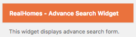

# Advance Search Widget

- Go to **Dashboard → Appearance → Widgets** and look for **RealHomes - Advance Search widget**.

- Use that widget in a sidebar and provide its title. 

- Now check out the front end of your site and you will have the **Advance Search** widget working for your site. 

