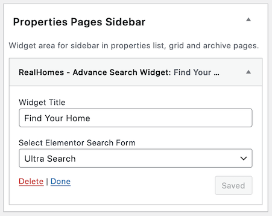
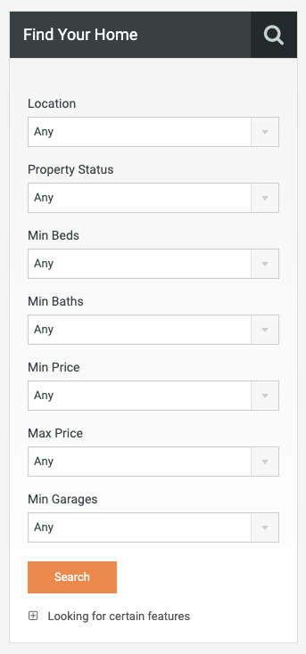

# Advance Search Widget

- Go to **Dashboard → Appearance → Widgets** and look for **RealHomes - Advance Search** widget.

- Use that widget in a sidebar and provide its title. 

**Classic & Modern**

**Ultra**

!!! warning
    In Ultra, you must create and select an Ultra Search form template because the Ultra design is elementor based. The widget won't display normally if the Elementor Search Form is not properly configured.

- Now check out the front end of your site and you will have the **Advance Search** widget working for your site. 

**Classic**

**Modern**

