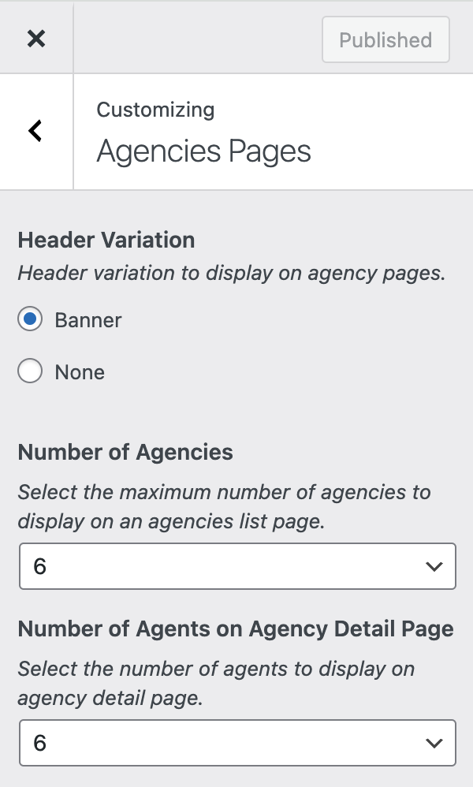
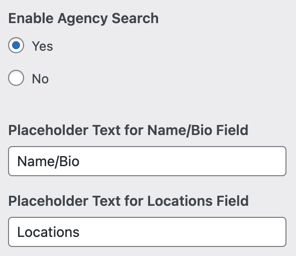
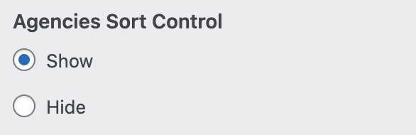
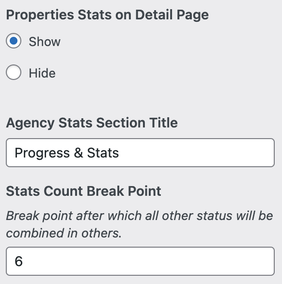
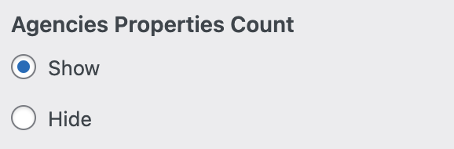
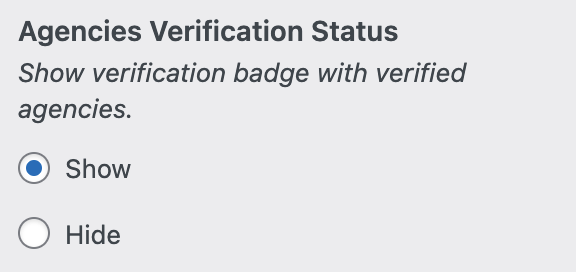
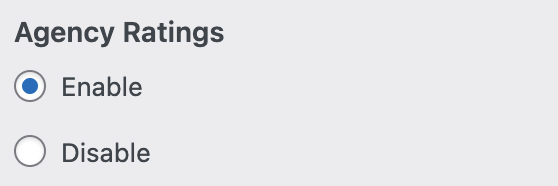
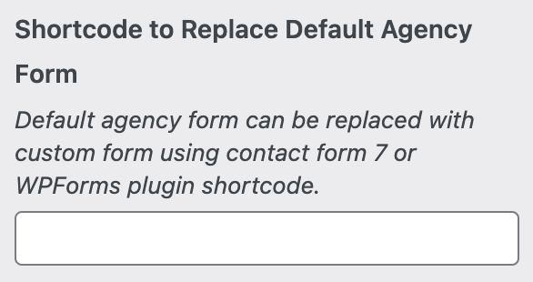

# Agencies Listing Settings

### **General Settings**

To configure settings for the Agencies' Listing page, please navigate to **Dashboard → RealHomes → Customize Settings → Agencies Pages**.

### **Agencies Search**

### **Agencies Sort Control**

### **Agencies Statistics**

The Agencies Statistics feature offers insights into the distribution of properties across various property taxonomies, providing detailed information on each category's prevalence.

### **Properties Count**

### **Verification Status**

### **Agencies Rating**

You can also activate agency rating functionality, empowering users to evaluate agencies based on their conduct.

### **Shortcode to Replace Default Contact Form**

