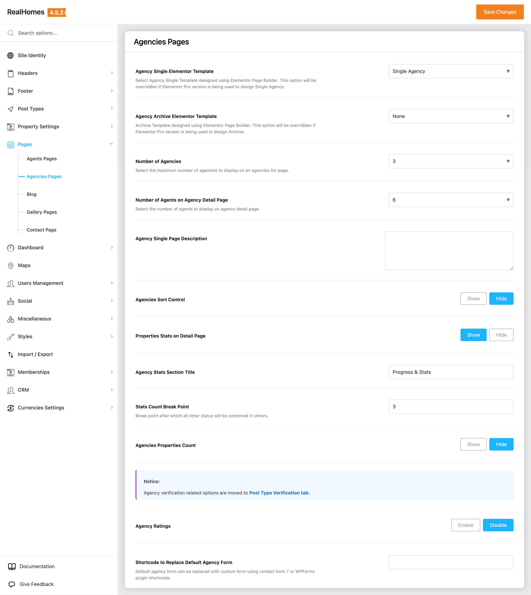
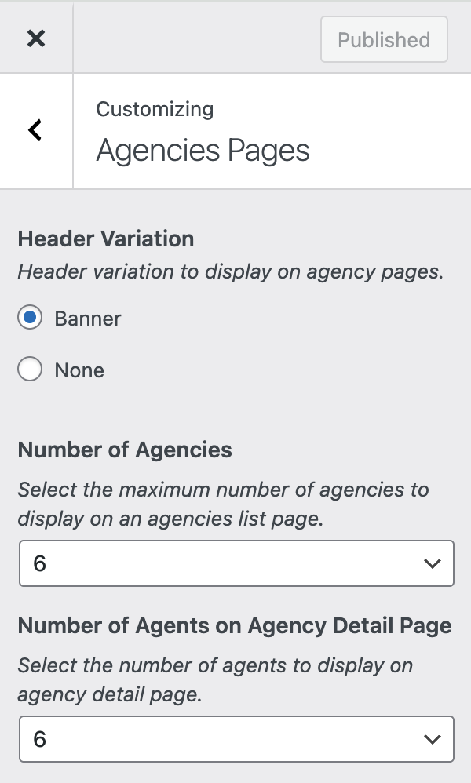
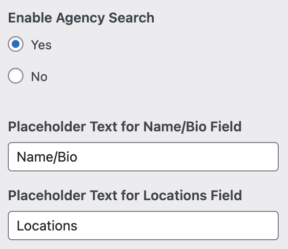
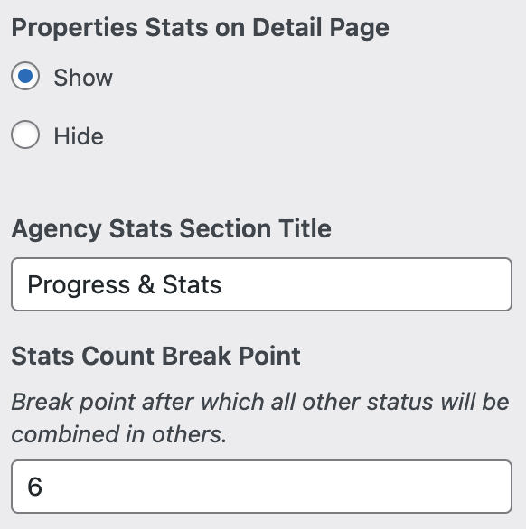
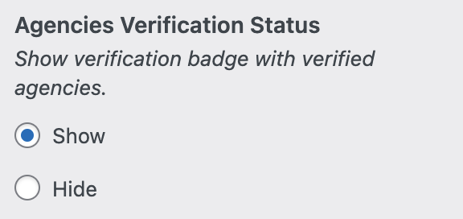
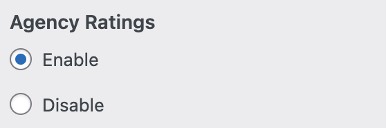
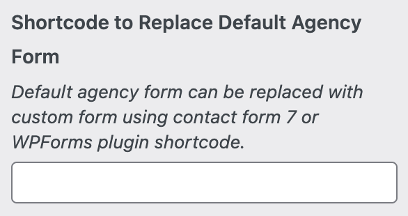

# Agencies Listing Settings

### **General Settings**

To configure settings for the Agencies' Listing page, navigate based on your version of the **RealHomes** theme:

=== "v4.5.1 and Later"

    !!! success "RealHomes Settings"
        Dashboard ➤ RealHomes ➤ Settings ➤ Pages ➤ Agencies

    

=== "v4.5.0 and Earlier"

    !!! info "Legacy Settings"
        Dashboard ➤ RealHomes ➤ Customize Settings ➤ Agencies Pages

    

### **Agencies Search**

You can enable or disable the search feature on the Agencies' Listing page.

=== "v4.5.1 and Later"

    !!! success "RealHomes Settings"
        Dashboard ➤ RealHomes ➤ Settings ➤ Pages ➤ Agencies

    

=== "v4.5.0 and Earlier"

    !!! info "Legacy Settings"
        Dashboard ➤ RealHomes ➤ Customize Settings ➤ Agencies Pages

    

### **Agencies Sort Control**

=== "v4.5.1 and Later"

    !!! success "RealHomes Settings"
        Dashboard ➤ RealHomes ➤ Settings ➤ Pages ➤ Agencies

    

=== "v4.5.0 and Earlier"

    !!! info "Legacy Settings"
        Dashboard ➤ RealHomes ➤ Customize Settings ➤ Agencies Pages

    

### **Agencies Statistics**

The Agencies Statistics feature offers insights into the distribution of properties across various property taxonomies, providing detailed information on each category's prevalence.

=== "v4.5.1 and Later"

    !!! success "RealHomes Settings"
        Dashboard ➤ RealHomes ➤ Settings ➤ Pages ➤ Agencies

    

=== "v4.5.0 and Earlier"

    !!! info "Legacy Settings"
        Dashboard ➤ RealHomes ➤ Customize Settings ➤ Agencies Pages

    

### **Properties Count**

=== "v4.5.1 and Later"

    !!! success "RealHomes Settings"
        Dashboard ➤ RealHomes ➤ Settings ➤ Pages ➤ Agencies

    

=== "v4.5.0 and Earlier"

    !!! info "Legacy Settings"
        Dashboard ➤ RealHomes ➤ Customize Settings ➤ Agencies Pages

    

### **Verification Status**

=== "v4.5.1 and Later"

    !!! success "RealHomes Settings"
        Dashboard ➤ RealHomes ➤ Settings ➤ Pages ➤ Agencies

    

=== "v4.5.0 and Earlier"

    !!! info "Legacy Settings"
        Dashboard ➤ RealHomes ➤ Customize Settings ➤ Agencies Pages

    

### **Agencies Rating**

You can also activate agency rating functionality, empowering users to evaluate agencies based on their conduct.

=== "v4.5.1 and Later"

    !!! success "RealHomes Settings"
        Dashboard ➤ RealHomes ➤ Settings ➤ Pages ➤ Agencies

    

=== "v4.5.0 and Earlier"

    !!! info "Legacy Settings"
        Dashboard ➤ RealHomes ➤ Customize Settings ➤ Agencies Pages

    

### **Shortcode to Replace Default Contact Form**

=== "v4.5.1 and Later"

    !!! success "RealHomes Settings"
        Dashboard ➤ RealHomes ➤ Settings ➤ Pages ➤ Agencies

    

=== "v4.5.0 and Earlier"

    !!! info "Legacy Settings"
        Dashboard ➤ RealHomes ➤ Customize Settings ➤ Agencies Pages

    