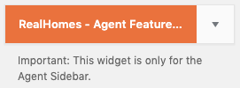
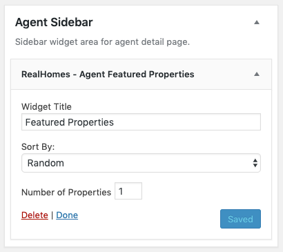
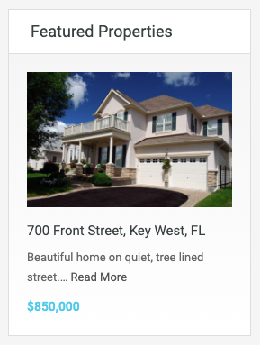
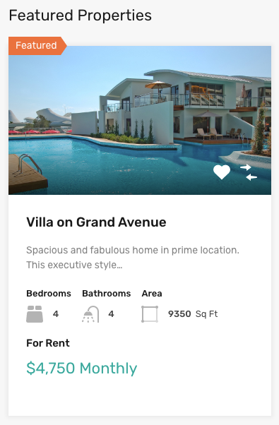

# Agent Featured Properties

- Go to **Dashboard → Appearance → Widgets** and look for **RealHomes - Agent Featured Properties** widget.

- Use this widget in the "Agent" sidebar and provide its title.

!!! info "Important"
    This widget is only for the Agent Sidebar.

Now check out the frontend of your site and you will have the **Agent Featured Properties** widget working for your site.

**Classic**

**Modern**

