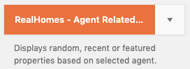
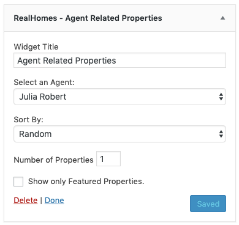
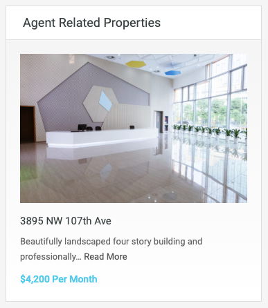
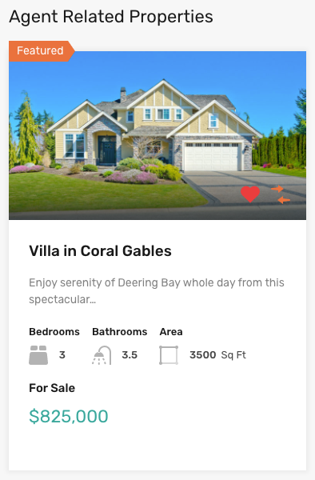

# Agent Related Properties Widget

- Go to **Dashboard → Appearance → Widgets** and look for **RealHomes - Agent Related Properties** widget.

- Use this widget in a sidebar and provide its title, select an agent and configure other related settings. 

Now check out the frontend of your site and you will have the **Agent Related Properties** widget working for your site.

**Classic**

**Modern**

