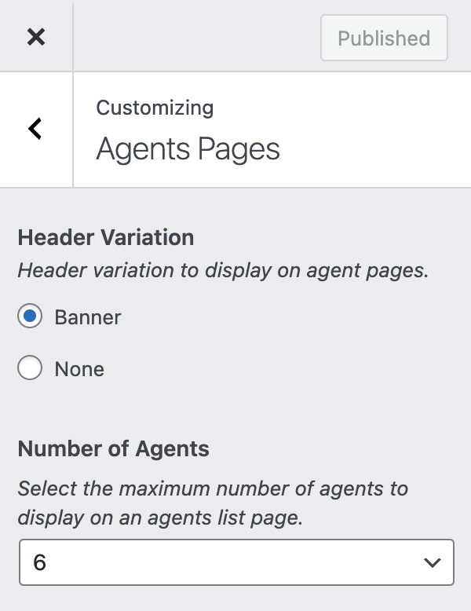
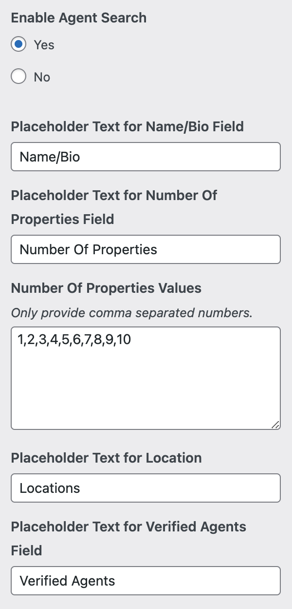
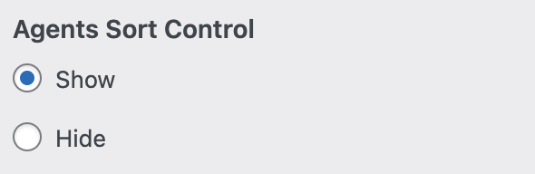
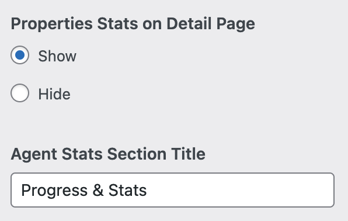
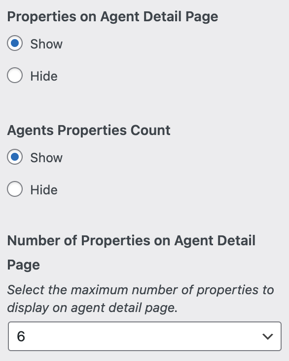
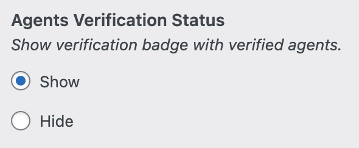
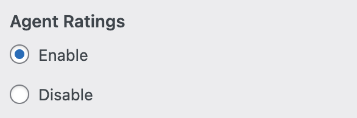

# Agents Listing Settings

### General Settings

To configure settings for the Agents' Listing page, please navigate to **Dashboard → RealHomes → Customize Settings → Agents Pages**.

### Agents Search

### Agents Sort Control

### Agents Search

### **Agents Statistics**

The Agents Statistics feature offers insights into the distribution of properties across various property taxonomies, providing detailed information on each category's prevalence.

### Properties on Single Agent page

### Verification Status

### **Agents Rating**

You can also activate agent rating functionality, empowering users to evaluate agents based on their conduct.

### Shortcode to Replace Default Contact Form

