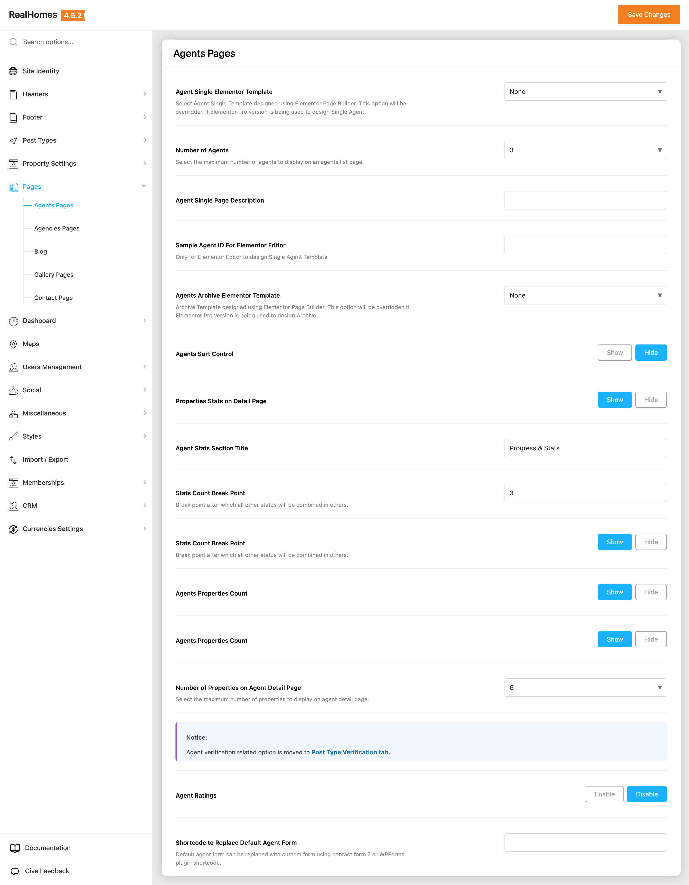
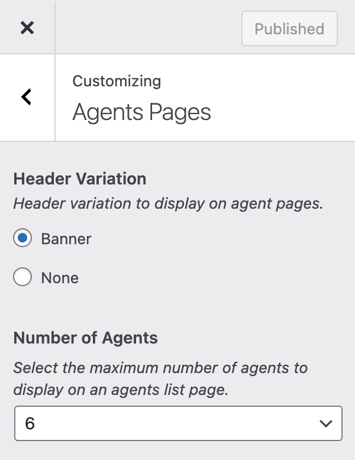
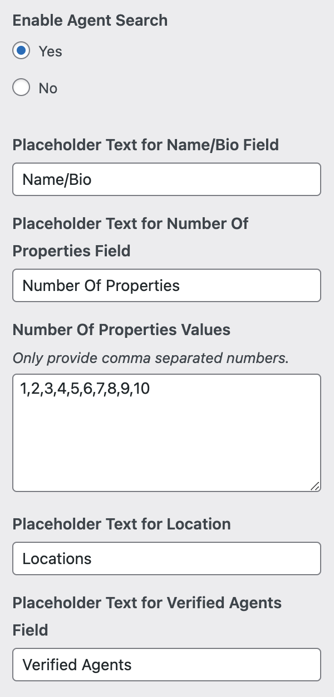
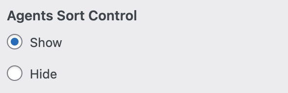
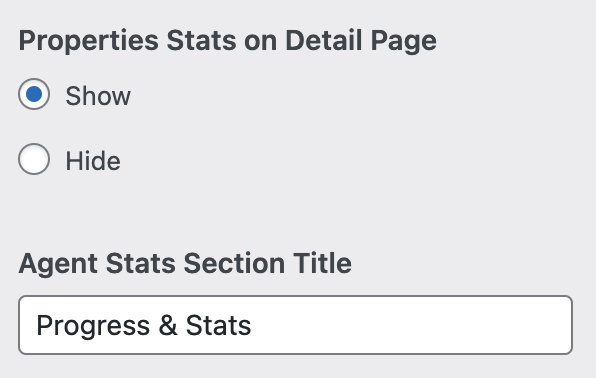
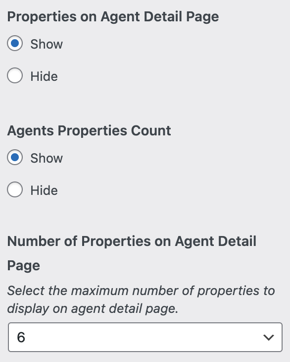
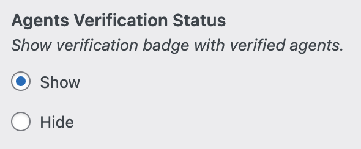
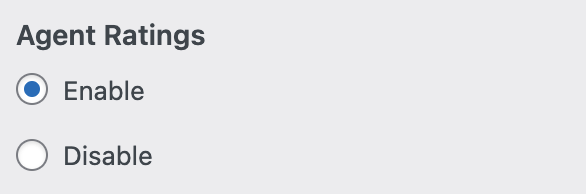

# Agents Listing Settings

### **General Settings**

To configure the Agents' Listing page settings, navigate based on your version of the **RealHomes** theme:

=== "v4.5.1 and Later"

    !!! success "RealHomes Settings"
        Dashboard ➤ RealHomes ➤ Settings ➤ Pages ➤ Agents

    

=== "v4.5.0 and Earlier"

    !!! info "Legacy Settings"
        Dashboard ➤ RealHomes ➤ Customize Settings ➤ Agents Pages

    

### **Agents Search**

You can enable or disable the search feature on the Agents' Listing page in the same section.

=== "v4.5.1 and Later"

    !!! success "RealHomes Settings"
        Dashboard ➤ RealHomes ➤ Settings ➤ Pages ➤ Agents

    

=== "v4.5.0 and Earlier"

    !!! info "Legacy Settings"
        Dashboard ➤ RealHomes ➤ Customize Settings ➤ Agents Pages

    

### **Agents Sort Control**

Allow users to sort agents by different criteria.

=== "v4.5.1 and Later"

    !!! success "RealHomes Settings"
        Dashboard ➤ RealHomes ➤ Settings ➤ Pages ➤ Agents

    

=== "v4.5.0 and Earlier"

    !!! info "Legacy Settings"
        Dashboard ➤ RealHomes ➤ Customize Settings ➤ Agents Pages

    

### **Agents Statistics**

The **Agents Statistics** feature provides insights into property distribution across various categories.

=== "v4.5.1 and Later"

    !!! success "RealHomes Settings"
        Dashboard ➤ RealHomes ➤ Settings ➤ Pages ➤ Agents

    

=== "v4.5.0 and Earlier"

    !!! info "Legacy Settings"
        Dashboard ➤ RealHomes ➤ Customize Settings ➤ Agents Pages

    

### **Properties on Single Agent Page**

This setting controls the display of properties associated with an agent on their single-agent page.

=== "v4.5.1 and Later"

    !!! success "RealHomes Settings"
        Dashboard ➤ RealHomes ➤ Settings ➤ Pages ➤ Agents

        

=== "v4.5.0 and Earlier"

    !!! info "Legacy Settings"
        Dashboard ➤ RealHomes ➤ Customize Settings ➤ Agents Pages

    

### **Verification Status**

Enable or disable the verification status feature for agents.

=== "v4.5.1 and Later"

    !!! success "RealHomes Settings"
        Dashboard ➤ RealHomes ➤ Settings ➤ Pages ➤ Agents

    

=== "v4.5.0 and Earlier"

    !!! info "Legacy Settings"
        Dashboard ➤ RealHomes ➤ Customize Settings ➤ Agents Pages

    

### **Agents Rating**

Activate agent rating functionality to allow users to rate agents based on their service.

=== "v4.5.1 and Later"

    !!! success "RealHomes Settings"
        Dashboard ➤ RealHomes ➤ Settings ➤ Pages ➤ Agents

    

=== "v4.5.0 and Earlier"

    !!! info "Legacy Settings"
        Dashboard ➤ RealHomes ➤ Customize Settings ➤ Agents Pages

    

### **Shortcode to Replace Default Contact Form**

You can replace the default contact form with a custom one using a shortcode.

=== "v4.5.1 and Later"

    !!! success "RealHomes Settings"
        Dashboard ➤ RealHomes ➤ Settings ➤ Pages ➤ Agents

    

=== "v4.5.0 and Earlier"

    !!! info "Legacy Settings"
        Dashboard ➤ RealHomes ➤ Customize Settings ➤ Agents Pages

    
