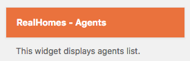
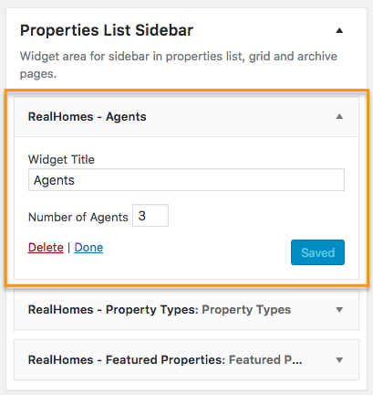

# Agents Widget

To add the **Agents Widget** to your website:

1. Navigate to **Dashboard → Appearance → Widgets**.
2. Locate the **RealHomes - Agents** widget in the list.

   

3. Drag and drop the widget into your desired sidebar area.
4. Provide a title and configure any other settings as needed.

   

Once configured, the **Agents Widget** will be active on the front end of your site.

**Classic**

**Modern**

