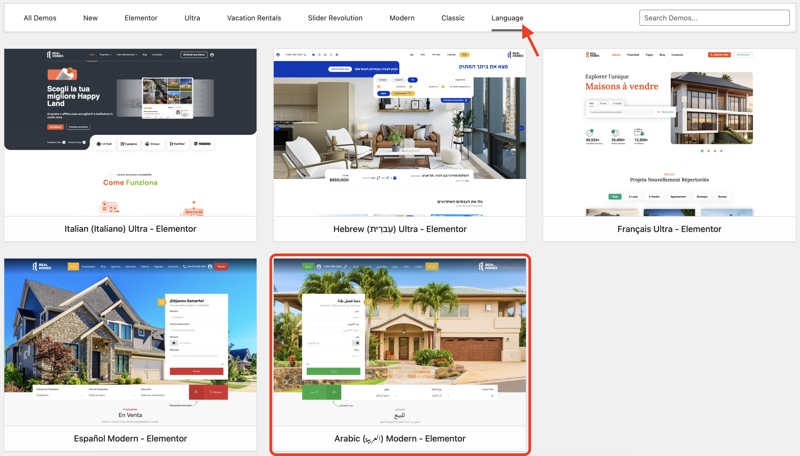

# Arabic Demo Setup Guide

!!! info "About Arabic Demo"
    The **Arabic Demo** provides a fully localized experience for Arabic-speaking markets. You can check it out live [here](https://demo.realhomes.io/arabic).  
    Please ensure you have completed the [Installation and Activation](installation-and-activation.md) steps before proceeding with the demo import.

---

### 🛠️ **Importing the Arabic Demo**

To import the **Arabic Demo content**, follow these steps:

1. Navigate to **RealHomes → Demo Import** in your WordPress dashboard.

   

2. Click the **Language** tab and then click the blue **Import Demo** button under the **Arabic Ultra - Elementor** option.

3. The system will check for required plugins.  
   - If any plugin is missing, it will be automatically installed.  
   - Click **Continue & Import** to proceed with the demo content import.

4. The import process will begin. It may take a few minutes to complete as images and data are fetched from the server.

   

!!! warning "Having trouble importing?"
    If the import process doesn't complete on the first try, simply run it again.  
    This is usually due to server response delays or timeout issues during image downloads.

---

### 🌍 **RTL Support**

The Arabic Demo features comprehensive **Right-to-Left (RTL)** support. This includes mirrored layouts, properly aligned typography, and RTL-optimized UI components, ensuring a native experience for Arabic users.

---

### ✅ **Demo Import Completed**

Once the import is complete, you'll see a confirmation screen like the one below:

Now visit your website — it should look exactly like the **[Arabic Demo](https://demo.realhomes.io/arabic)**.

---

For further assistance, please [register or log in](https://support.inspirythemes.com/login-register/) to our support portal and [submit your question](https://support.inspirythemes.com/ask-question/).  
Our support team will be happy to help you.
