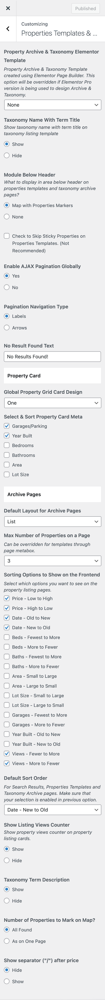

# Properties Archive / Taxonomy Pages

Customize the layout, behavior, and display options for **Properties Listing**, **Properties Archive** and **Taxonomy Listing** pages by navigating to **Dashboard → RealHomes → Customize Settings → Properties Templates & Archive**.

---

### **Elementor Template for Archive & Taxonomy Pages**  
You can select a **custom template** created with Elementor Page Builder for the Archive and Taxonomy pages.  
> ⚠️ **Available only in Ultra Design**  
This setting allows a highly flexible layout using Elementor Pro. If Elementor Pro is not used or no template is selected, default theme layouts will apply.

---

### **Taxonomy Name with Term Title**
Toggle to show or hide the taxonomy name (e.g. Property Type, Status, Location) alongside the term title.

- **Show** – Displays "Property Type: Apartment"
- **Hide** – Displays only the term name like "Apartment"

---

### **Module Below Header**
Choose what appears below the header on Property Archive and Taxonomy pages:

- **None** – Displays nothing under the header.
- **Map with Properties Markers** – Displays an interactive map with properties.

---

### **Sticky Properties Handling**
Enable to skip sticky properties on Archive & Taxonomy pages.  
> ⚠️ Not recommended unless you have a specific use case.

---

### **Enable AJAX Pagination Globally**
Switch to **Yes** to load properties without a full page reload during pagination.  
Improves user experience and speed, especially on slower servers.

---

### **Pagination Navigation Type**
Choose the navigation style:

- **Labels** – Shows "Previous / Next"
- **Arrows** – Displays arrow icons for pagination

---

### **No Result Found Text**
Customize the message shown when no properties match the filters or query.  
_Default: "No Results Found!"_

---

### **Global Property Grid Card Design**
Choose from different card designs. Currently available options:

- **One**
- **Two**
- (May vary depending on the active design)

---

### **Select & Sort Property Card Meta**
Choose which meta details appear on each property card:

- Garages/Parking  
- Year Built  
- Bedrooms  
- Bathrooms  
- Area  
- Lot Size

---

### **Default Layout for Archive Pages**
Set the layout used for property archive pages:

- **List**
- **Grid**

---

### **Max Number of Properties per Page**
Control how many properties appear per page.  
> Can be overridden using individual page template settings via page meta box.

---

### **Sorting Options (Frontend)**
Select which sorting options are available to users on the frontend:

- Price: Low to High / High to Low  
- Date: New to Old / Old to New  
- Beds / Baths / Area / Year Built / Lot Size  
- Garages / Views  
> Each option supports sorting in both directions.

---

### **Default Sort Order**
Choose which sorting is used by default for:

- Archive Pages  
- Taxonomy Pages  
- Search Results

---

### **Show Listing Views Counter**
Toggle the display of property view counters on the property cards.

- **Show** – Displays view count  
- **Hide** – Hides the counter

---

### **Show Taxonomy Term Description**
Enable this option to show a description (if provided) for the taxonomy term on archive pages.

---

### **Map – Number of Properties to Mark**
- **All Found** – Show all properties on the map
- **As on One Page** – Show only the properties currently visible in pagination

---

### **Show Separator ("/") after Price**
If enabled, a separator will be added after the property price on the listing cards.