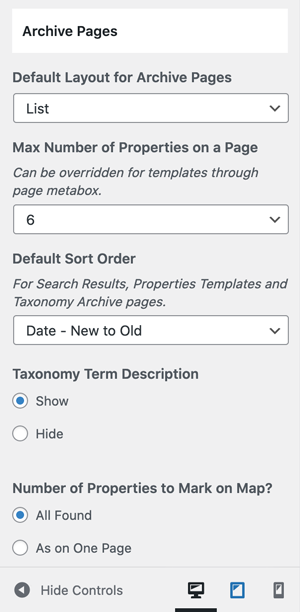

# Properties Archive / Taxonomy Pages

### **Settings for Properties Archive / Taxonomy Pages**

The settings for Properties Archive & Taxonomy pages are located in **Dashboard → RealHomes → Customize Settings → Properties Templates & Archive**.

### **Ultra**

### **Modern**

### **Classic**

### **Properties Card Settings**

You can change the **Properties Card's** settings for **Grid Layout** in **Dashboard → RealHomes → Customize Settings → Properties Templates & Archive**.

### **Grid Templates**

