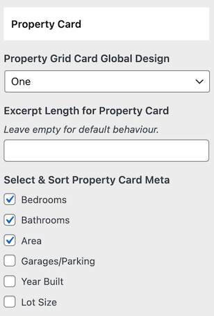

# Properties Archive / Taxonomy Pages

### **Settings for Archive/Taxonomy Pages**

Configure the settings for Properties Archive & Taxonomy pages by navigating to:

**Dashboard → RealHomes → Customize Settings → Properties Templates & Archive**

### **Ultra**

Settings for Ultra design:

### **Modern**

Settings for Modern design:

### **Classic**

Settings for Classic design:

### **Properties Card Settings**

Adjust the **Properties Card** settings for Grid Layouts here:

### **Grid Templates**

You can also manage Grid Templates under the same settings.

