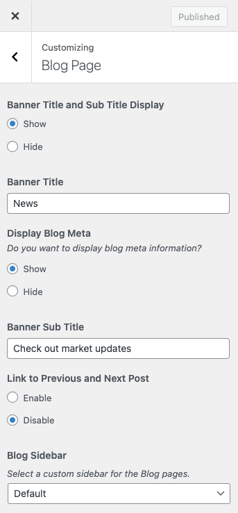

# Blog Page Settings

You can customize the **Blog Page** related settings easily within the **Customizer** panel. Simply navigate to [ **Dashboard → RealHomes → Customize Settings → Blog Page** ] to access these options.

### **Classic**

---

### **Header Variation**
Choose how the header should appear on the blog (news) page.

- **Banner** – Displays the standard page banner (recommended).
- **None** – Hides the header banner entirely.

---

### **Banner Title**
Set a custom title to be displayed in the banner area of the Blog page.  
*Example:* Use “News”, “Updates”, “From Our Blog”, etc.

---

### **Display Blog Meta**
Enable or disable meta information (such as post date, author, and categories) on blog posts.

- **Show** – Displays meta info below each blog post title.
- **Hide** – Hides blog post meta data.

---

### **Banner Sub-Title**
Set a custom sub-title to be shown in the banner area of the Blog page.  
*Example:* Use Check out market updates, “Explore the Real Estate market”, etc.

---

### **Previous & Next Post Links**
You can enable/disable the links to previous or next blog posts.

---

### **Sidebar**
Select a custom sidebar to display on the Blog page.  
Choose from:

- **Default** – Uses the default blog sidebar.
- Or any custom sidebar you've registered.