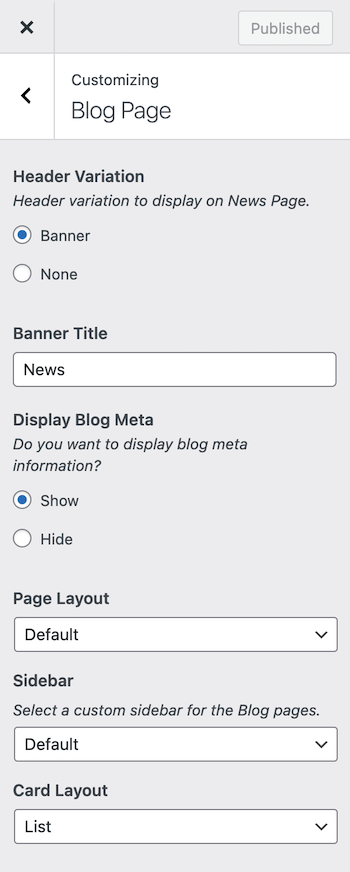

# Blog Page Settings

You can customize the **Blog Page** display and behavior through the Customizer.  
Navigate to **Dashboard → RealHomes → Customize Settings → Blog Page**.

---

### **Header Variation**
Choose how the header should appear on the blog (news) page.

- **Banner** – Displays the standard page banner (recommended).
- **None** – Hides the header banner entirely.

---

### **Banner Title**
Set a custom title to be displayed in the banner area of the Blog page.  
*Example:* Use “News”, “Updates”, “From Our Blog”, etc.

---

### **Display Blog Meta**
Enable or disable meta information (such as post date, author, and categories) on blog posts.

- **Show** – Displays meta info below each blog post title.
- **Hide** – Hides blog post meta data.

---

### **Page Layout**
Select the page layout for the Blog page:

- **Default** – Uses the theme's default layout.
- Other layout options may vary depending on your active design.

---

### **Sidebar**
Select a custom sidebar to display on the Blog page.  
Choose from:

- **Default** – Uses the default blog sidebar.
- Or any custom sidebar you've registered.

---

### **Card Layout**
Choose how blog posts appear:

- **List** – Displays posts in a vertical list format.
- (Other layouts like Grid may be available depending on your design)

---

### **Display Similar Posts on Blog Single**
Enable this option to show related or similar blog posts at the end of each single blog post.

- **Show** – Displays a section of related blog posts.
- **Hide** – Disables the related posts section.