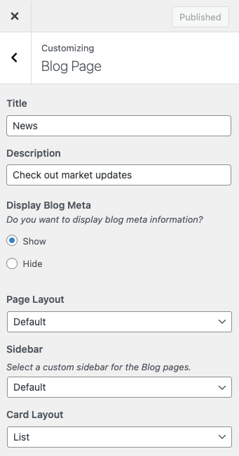

# Blog Page Settings

You can customize the **Blog Page** related settings easily. Navigate based on your version of the **RealHomes** theme:

=== "v4.5.1 and Later"

    !!! success "RealHomes Settings"
        Dashboard ➤ RealHomes ➤ Settings ➤ Pages ➤ Blog
        
=== "v4.5.0 and Earlier"

    !!! info "Legacy Settings"
        Dashboard ➤ RealHomes ➤ Customize Settings ➤ Blog Page

    

---

### **Title**
Set a custom title to be shown on the Blog page.  
*Example:* Use “News”, “Updates”, “From Our Blog”, etc.

---

### **Description**
Set a custom description to be displayed on the Blog page.  
*Example:* Use Check out market updates, “Explore the Real Estate market”, etc.

---

### **Display Blog Meta**
Enable or disable meta information (such as post date, author, and categories) on blog posts.

- **Show** – Displays meta info below each blog post title.
- **Hide** – Hides blog post meta data.

---

### **Page Layout**
Select the page layout for the Blog page:

- **Default** – Uses the theme's default layout.
- Other layout options may vary depending on your active design.

---

### **Sidebar**
Select a custom sidebar to display on the Blog page.  
Choose from:

- **Default** – Uses the default blog sidebar.
- Or any custom sidebar you've registered.

---

### **Card Layout**
Choose how blog posts appear:

- **List** – Displays posts in a vertical list format.
- (Other layouts like Grid may be available depending on your design)

---

### **Display Similar Posts on Blog Single**
Enable this option to show related or similar blog posts at the end of each single blog post.

- **Show** – Displays a section of related blog posts.
- **Hide** – Disables the related posts section.