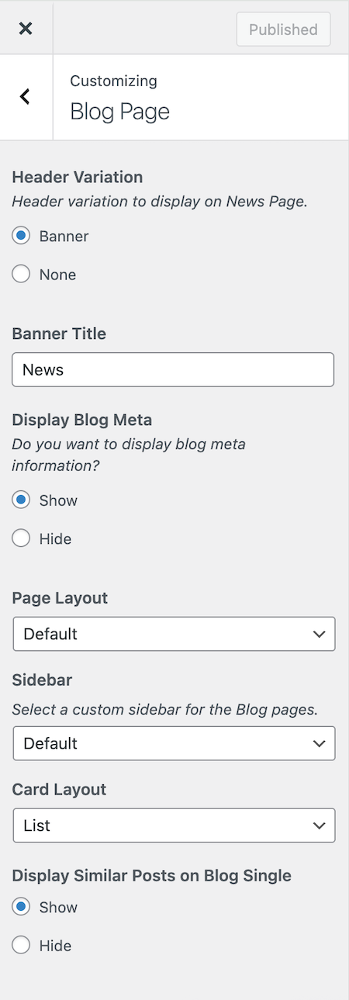

# Blog Page Settings

You can customize the **Blog Page** related settings easily within the **Customizer** panel. Simply navigate to [ **Dashboard → RealHomes → Customize Settings → Blog Page** ] to access these options.

