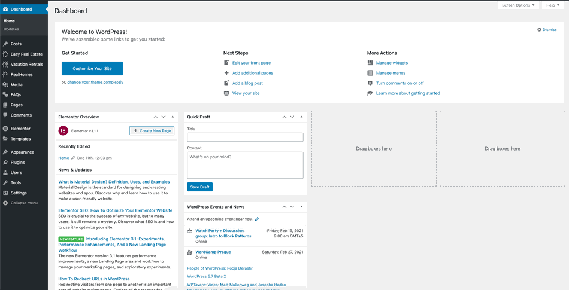
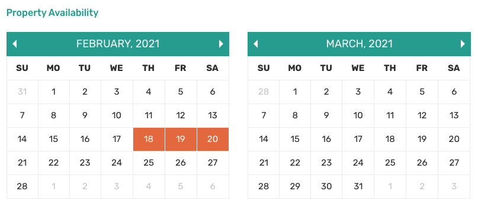
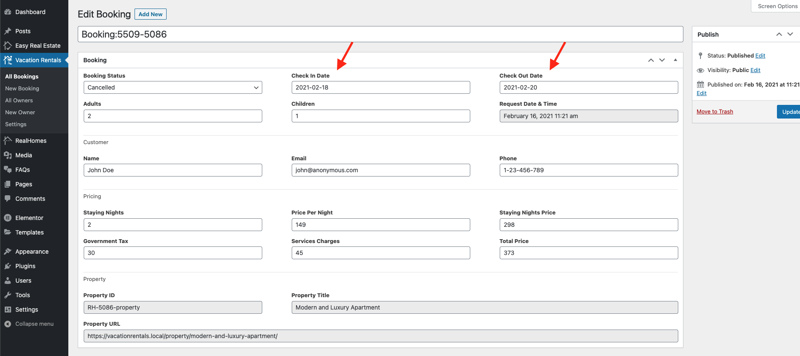

### **How to Find the Bookings**

All the bookings (confirmed, pending or cancelled) can be managed at **Dashboard &rarr; Vacation Rentals &rarr; All Bookings**.

### **Confirm, Cancel or Reject a Booking**

You can confirm, cancel or reject any booking by changing its **Booking Status** (demonstration below).

Once a booking is confirmed then the **Booking Dates** will be highlighted as booked on the related **Property Detail Page** in **Property Availability Calender**.

### **Extend a Booking**

Any booking can be extended by modifying its **Check In** and **Check Out Dates**.

