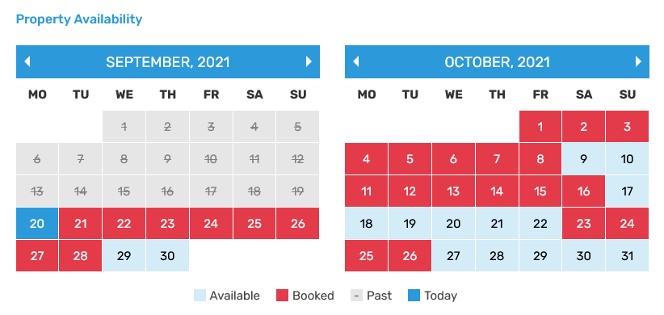

# Managing Bookings

### **How to Find the Bookings**

You can manage all bookings (confirmed, pending, or canceled) from **Dashboard → Vacation Rentals → All Bookings**.

### **Confirm, Cancel, or Reject a Booking**

To change the status of a booking:

1. Select the booking from the list.
2. Change its **Booking Status** to either confirm, cancel, or reject.

   

Once confirmed, the **Booking Dates** will be marked as booked on the **Property Detail Page** under the **Property Availability Calendar**.

### **Extend a Booking**

You can extend a booking by adjusting the **Check-In** and **Check-Out Dates**.

