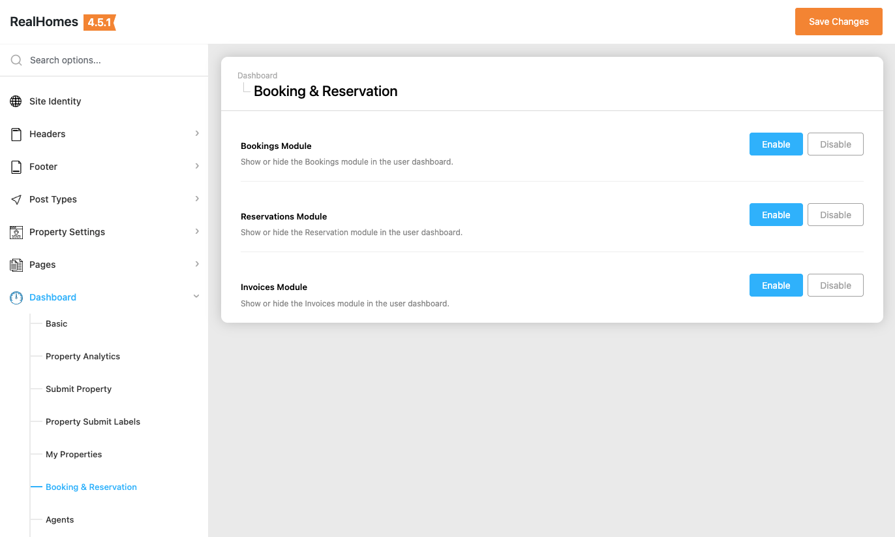
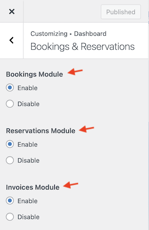
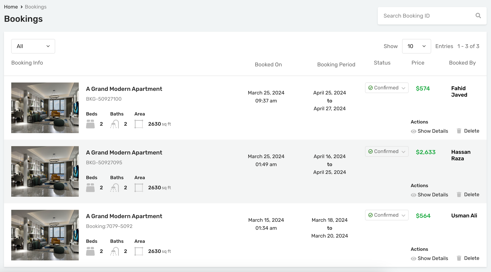
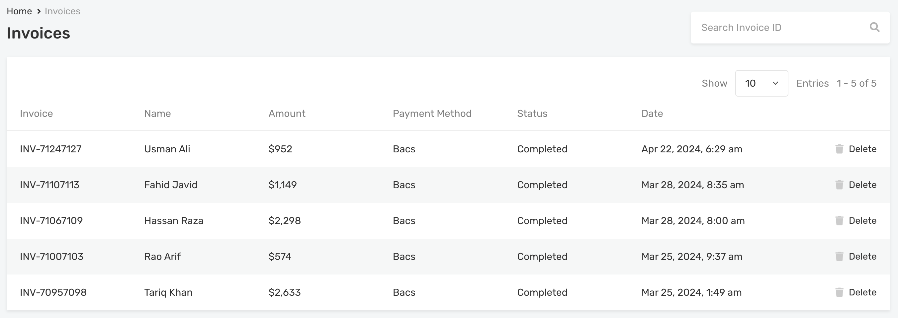

# Bookings, Reservations & Invoices

!!! info "Important"
    This module is available only if you are using the **Vacation Rentals plugin**.

To enable or disable these modules, navigate based on your version:

=== "v4.5.1 and Later"

    !!! success "RealHomes Settings"
        Dashboard ➤ RealHomes ➤ Settings ➤ Dashboard ➤ Bookings & Reservations

    

=== "v4.5.0 and Earlier"

    !!! info "Legacy Settings"
        Dashboard ➤ RealHomes ➤ Customize Settings ➤ Dashboard ➤ Bookings & Reservations

    

### **Bookings**

Here's what the **Bookings** module looks like:

### **Invoices**

Here’s an overview of the **Invoices** module:

